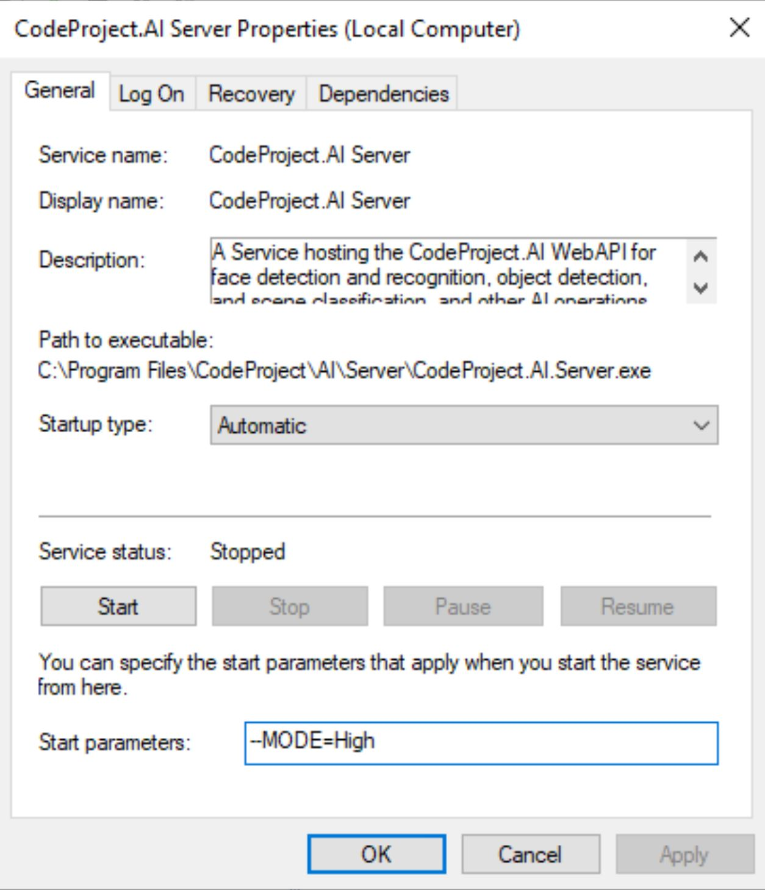

# Configuring Server and Module Settings

## How are settings provided to the Server and Modules?

Each module is passed a collection of settings when it is started. These settings come from
multiple sources: the server itself, settings files, environment variables and the command line. The settings in each source will overwrite existing settings, so sources are loaded in order of most general to most specific to allow you to fine tune settings to specific targets

1. All **appsettings.json** files under the /server directory. These are loaded in order:
    1. **appsettings..json**
    1. **appsettings.*mode*.json** file, where **mode** = release or development.
    2. **appsettings.*platform*.json** file, where **platform** = windows, linux, macOS, or each of these with -arm64 for Arm variants, or docker.
    3. **appsettings.*platform*.*mode*.json**

    Settings in the appsettings.json files are typically server related.

2. All **modulesettings.json** files within the module's folder, loaded in the following order:
    1. **modulesettings.json**
    1. **modulesettings.*mode*.json** where **mode** = release or development.
    2. **modulesettings.*os*.json** where **os** = windows, linux, macOS
    2. **modulesettings.*os*.*mode*.json** 
    2. **modulesettings.*os*.*architecture*.json** where **architecture** = x86_64 or arm64
    2. **modulesettings.*os*.*architecture*.*mode*.json**
    2. **modulesettings.docker.json**
    2. **modulesettings.docker.*mode*.json**
    2. **modulesettings.*device*.json** where device = raspberrypi, orangepi or jetson
    2. **modulesettings.*device*.*mode*.json**

    Settings in the modulesettings.json files are typically module related.

3. If you change a module or server setting via the API (or view the dashboard) these settings will be saved in a settings 'override' file in **%PROGRAMDATA%\modulesettings.json** and **%PROGRAMDATA%\serversettings.json**. The `PROGRAMDATA` location will be
    - Windows: **C:\ProgramData\CodeProject\AI**
    - Linux / Docker: **/usr/share/CodePrpoject/AI**
    - macOS: **/Library/Application Support/CodeProject/AI**
4. Environment variables

   See [Individual Module settings](module_settings.md#individual-module-settings) for information on environment variables for modules.

5. Command line variables


## Changing a Module's Settings

There are multiple ways in which a module can be configured

1. Editing the modulesettings.json file (or files) in the module's directory
2. Setting environment variables on the system
3. Using command line parameters (if running as a Windows application or service)
4. Setting Docker run parameters (if running the Docker image)
5. Via the Settings API

There are also global settings stored in the server's appsettings.json file that
provides settings shared by all modules.

We will go through the naming convention for settings, the global server 
settings, individual module settings and legacy override settings, then
finish with a walk through of how to actually change these settings.

## The Naming Convention

To change a setting we need to refer to it by name, and that name depends on
the context of where we are making the change. 

If changing a setting in the modulesettings.json file, then the setting is 
referenced within the Json struncture by name

For example, the `MODEL_SIZE` setting for the ObjectDetectionYolo module would
be in the `modules/ObjectDetectionYolo/modulesettings.json` file:

```json
{
  "Modules": {
    "ObjectDetectionYolo": {
      ...
      "EnvironmentVariables": {
        "MODEL_SIZE": "Medium"
        ...
      }
    }
  }
}
```

If setting a value via the command line, as an environment variable, or when
launching a Docker container, the setting is accessed via its fully qualified
name.

For common module settings the form is
`--Modules:<ModuleId>:Setting-Name=Value`

For module specific settings the form is
`--Modules:<ModuleId>:EnvironmentVariables:Setting-Name=Value`

For legacy overrides use the format `--Setting-Name=Value`

The current pre-installed modules are

| Module                             | ModuleId              |
|:----------                         |:-------               |
| Face Processing                    | FaceProcessing        |
| Object Detection (.NET, ONNX)      | ObjectDetectionNet    |
| Object Detection (Python, PyTorch) | ObjectDetectionYolo   |

and downloadable (installable at runtime) modules are

| Module                             | ModuleId              |
|:----------                         |:-------               |
| Background Remover                 | BackgroundRemoval     |
| Cartooniser                        | Cartooniser           |
| Image Super Resolution             | SuperResolution       |
| Licence Plate reader               | ALPR                  |
| Object Detection (Coral)           | ObjectDetectionCoral  |
| Object Detection (Rockchip)        | ObjectDetectionYoloRKNN |
| Object Detection (YOLOv5 3.1)      | YOLOv5-3.1            |
| Optical Character Recognition      | OCR                   | 
| Portrait Filter (background blur)  | PortraitFilter        | 
| Scene Classification               | SceneClassification   |
| Text Sentiment Analysis            | SentimentAnalysis     | 
| Text Summary                       | TextSummary           |
| Training (YOLO)                    | TrainingYolov5        |


## Macros for settings

There are a number of macros that can be used in string values when providing values. These macros will be replaced by their actual value at runtime.

| Macro                  | Description |
|:-----------------------|:------------|
| %ROOT_PATH%|The path to the application's root. For a default Windows install this is `C:\Program Files\CodeProject\AI`. For Docker this is `/app`|
| %RUNTIMES_PATH%         | The path to the installed, shared runtimes. Default is /src/runtimes in development, /runtimes in production (relative to ROOT_PATH) |
| %MODULES_PATH%         | The path to the Analysis modules. Default is /src/AnalysisLmodulesayer in development, /modules in production (relative to ROOT_PATH) |
| %CURRENT_MODULE_PATH%  | The path to the current module relative to %ROOT_PATH% |
| %PLATFORM%             | windows, macos, macos-arm64, linux, linux-arm64 |
| %OS%                   | Windows, macOS or Linux |
| %DATA_DIR%             | The path to the directory that contains persisted data. This default to<br>`C:\ProgramData\CodeProject\AI`&nbsp;(Windows)<br>`/usr/share/CodePrpoject/AI`&nbsp;(Linux)<br>`/Library/Application Support/CodeProject/AI`&nbsp;(macOS)|
| %PYTHON_RUNTIME%       | Python37 or Python39, Depending on the Runtime value in modulesettings.json|
| %PYTHON_BASEPATH%      | The path to the root of the virtual environment for the given version|

## The Settings

### Global (server) settings

Use the naming format `Modules:<ModuleId>:EnvironmentVariables:Setting-Name=Value`

| Parameter | Default | Description |
|:----------|:------- |:----------- |
| CPAI_PORT  | 32168 | The port that both client apps and back-end modules communicate with the server |
| CPAI_APPROOTPATH | %ROOT_PATH% | The absolute path to the application root directory |

eg Command line parameter:<br>
`--Modules:BackgroundRemoval:EnvironmentVariables:CPAI_PORT=32168`

eg System environment variable
  `set Modules:BackgroundRemoval:EnvironmentVariables:CPAI_PORT=32168`

### Common Module settings

Use the naming format `Modules:<ModuleId>:<Section>:Setting-Name=Value`. For example,
AutoStart in the LaunchSettings section for module "TextSummary" will be specified
as `Modules:TextSummary:LaunchSettings:AutoStart`.

Each module will have the following settings

| Section:Parameter | Default | Description |
|:----------|:------- |:----------- |
| LaunchSettings:AutoStart  | varies  | True or False. Determines whether or not this module is started automatically when the server starts |
| LaunchSettings:Parallelism | 0     | The number of concurrent execution units (threads, tasks, processes - depends on the module and language) to launch. Default of 0 means "Number of CPUs - 1"
| LaunchSettings:PostStartPauseSecs | 0&nbsp;(CPU)<br>5&nbsp;(GPU) | The number of seconds to pause after starting this module. This provides initialisation time |
| GpuOptions:InstallGPU | false | True or False. Determines whether or not this module is installed with GPU support. If this is False, then EnableGPU will have no effect |
| GpuOptions:EnableGPU | varies | True or False. Whether or not this module should enable GPU support. Setting to False means GPU support will be disabled. Note that GPU support depends on the module and the platform. A module is not guaranteed to support GPUs, or to support GPUs on all platforms |
| GpuOptions:AcceleratorDeviceName |  | Module dependant, but for modules that use CUDA, for example, this could be "cuda:0" or "cuda:1" to specify the first or second CUDA enabled GPU |
| GpuOptions:HalfPrecision |  | Module dependant, but for modules that use CUDA this specifies whether half-precision operations should be used. Valid only for cards with CUDA compute capability >= 6.0 |

eg Command line parameter:<br>
`--Modules:TextSummary:LaunchSettings:AutoStart=true`

eg System environment variable
  `set Modules:TextSummary:LaunchSettings:AutoStart=true`


### Individual Module settings

Many modules have individual settings that are changed via environment variables. 
Use the naming format `Modules:<ModuleId>:EnvironmentVariables:Setting-Name=Value`.

#### Object Detector (Yolo)

| Key | Default | Description |
| ---------------- | ------- | -- |
| MODELS_DIR       | %MODULES_PATH%\ObjectDetectionYolo\assets | The path to the folder containing model files |
| CUSTOM_MODELS_DIR | %MODULES_PATH%\ObjectDetectionYolo\custom-models | The path to the folder containing custom model files |
| MODEL_SIZE       | Medium | The detection model size. Tiny, Small, Medium or Large. **This setting has no effect for custom models.** |
| USE_CUDA         | True | Whether or not to use CUDA if available          |

For example, to set the `MODEL_SIZE` to Large via the command line use

`--Modules:ObjectDetectionYolo:EnvironmentVariables:MODEL_SIZE=Large`

To set the model directory to point to a different set of custom models, use

`--Modules:ObjectDetectionYolo:EnvironmentVariables:CUSTOM_MODELS_DIR="C:\My Custom Models"`

#### Object Detector (.NET)

| Key | Default | Description |
| ---------------- | ------- | -- |
| MODEL_SIZE       | Medium | The detection model size. Small, Medium or Large. |

For example, to set the `MODEL_SIZE` to Large via the command line use

`--Modules:ObjectDetectionNet:EnvironmentVariables:MODEL_SIZE=Large`


#### Scene Classifier

| Key | Default | Description |
| ---------------- | ------- | -- |
| MODELS_DIR       | %MODULES_PATH%\Vision\assets | The path to the folder containing model files |
| MODE             | MEDIUM | The detection resolution. Low, Medium or High |

<!-- Not used
| CUDA_MODE        |  False |
-->

For example, to set the `MODE` to High use

`--Modules:SceneClassification:EnvironmentVariables:MODE=High`

#### Face Detection

| Key | Default | Description |
| ---------------- | ------- | -- |
| MODELS_DIR       | %MODULES_PATH%\Vision\assets | The path to the folder containing model files |
| MODE             | MEDIUM | The detection resolution. Low, Medium or High |
| DATA_DIR         | %DATA_DIR% | The path to the folder containing persisted face data |
| USE_CUDA         | True | Whether or not to use CUDA if available |

For example, to set the MODE to High use

`--Modules:FaceProcessing:EnvironmentVariables:MODE=High`

These environment variables are shared by all Face processing modules 

#### Text Summary

For environment variables, the parameter prefix is:  `--Modules:TextSummary:EnvironmentVariables:`

| Key | Default | Description |
| ---------------- | ------- | -- |
| NLTK_DATA       | %MODULES_PATH%\\TextSummary\\nltk_data | The path to the folder containing the model file |

For example, to set the NLTK_DATA to 'my-data' use

`--Modules:TextSummary:EnvironmentVariables:NLTK_DATA=my-data`

### Global legacy setting overrides

In order to provide legacy support for some modules a number of command line
parameters are supported that provide overrides for multiple modules. 

These settings apply to **Face Processing**, **Scene Classification**, and 
**Object Detection** modules only.

Use the format `--Setting-Name=Value` on the command line, or 
`Setting-name=Value` as a system environment variable.


| Parameter | Default | Description |
|:---------|:------- |:----------- |
| PORT      | 32168 (standard)<br>5000 (alt for Windows, Linux)<br>5500 (alt for macOS) | The port on which the server listens for requests |
| MODE      | Medium  | The detection mode for vision operations. High, medium or low resolution inference |
| DATA_DIR  | `C:\ProgramData\CodeProject\AI`&nbsp;(Windows)<br>`/usr/share/CodePrpoject/AI`&nbsp;(Linux)<br>`/Library/Application Support/CodeProject/AI`&nbsp;(macOS)<br>| The directory containing persisted data for face recognition |
| MODELSTORE-DETECTION<br>MODELSTORE_DETECTION | `%MODULES_PATH%\\ObjectDetectionYolo\\custom` | The directory containing the custom AI models |
| VISION-FACE<br>VISION_FACE | True | Whether face detection operations are enabled |
| VISION-SCENE<br>VISION_SCENE | True | Whether scene classification is enabled |
| VISION-DETECTION<br>VISION_DETECTION | True | Whether object detection operations are enabled |
| CUDA_MODE | True | Whether CUDA support is to be enabled |

Where `%MODULES_PATH%` is a macro that expands to be the absolute path to the analysis modules directory. By default this is `C:\Program Files\CodeProject\AI\modules` for a Windows install, and `/app/modules` for Docker.

eg `--MODE=Medium`


## Making changes to settings

### Option 1: Editing the modulesettings.json files

!!! Warning "Proceed with caution"

	While configuring modules is very straightforward, if you make a mistake
	you may cause a module to no longer function correctly. Always make a backup of any files you
	modify just in case you need to undo your changes.

The modules included with CodeProject.AI are configued via the `modulesettings.json` files in the module's
directory, typically located at `C:\Program Files\CodeProject\AI\modules\<ModuleName>\modulesettings.json`, where `ModuleName` is the name of the module.

There are variants of this file for each supported operating system, in the form
`modulesettings.<platform>.json`, where platform will be windows, macos, macos-arm, linux or docker.

To read more about the modulesettings file, please refer to the 
[developer's guide](../devguide/module_examples/adding_new_modules.md#the-modulesettingsjson-file)

To edit values simply open this file in a text editor such as Notepad or Notepad++, make your 
changes and then save the file. Please, please, please make a backup first.

### Option 2: Setting environment variables on the system

For Windows:

 - Click the Start menu and type 'Environment'. Select 'Edit the system Environment variables'.
 - Click 'Environment variables'
 - Click either User or System variables. User variables will be in effect only when you are logged in. System variables are in effect for everyone.
 - Click New to add a new variable name and value, or click an existing variable, and then click Edit to change its name or value.

 For macOS:

 - Open a terminal window and type `touch .zprofile` to ensure a .zprofile file exists (This assumes you are using zsh in macOS. For bash use .bash_profile)
 - Run `nano .profile` to edit the file
 - Add or edit variables in the form `export MY_VARIABLE='my value'` 
 - Save and close the file
 - Run `source .zprofile` to force the changes to be loaded

### Option 3: Restarting the CodeProject.AI service and supplying parameters

By default the Windows installer will install CodeProject.AI as a Windows Service that
will start when Windows starts, and restart automatically on failure. If you wish to
customise settings then you can opt to start the CodeProject.AI Server's service manually
and pass command line parameters to override settings

First, stop the service from a terminal:

``` cmd title='Command line'
sc stop "CodeProject.AI Server"
```

Then restart the service, passing in the parameters you wish:

``` cmd title='Command line'
sc start "CodeProject.AI Server" --MODE=Low
```

This will restart the service and set the AI mode for Vision inference to "low".

<!--
#### Option 1: Using the Windows Service Manager

Open the Windows Services Manager by either

1. Click the Start button (bottom left corner of Windows) and start typing "Services". The Services
   app will appear in the search results. Open this.
2. Hit Windows Key + "r" (Command + r on a Mac keyboard) to open the Run Dialog, enter '%windir%\system32\services.msc' and hit OK

Scroll down the list of services until you find "CodeProject.AI Server". Double click this
entry to open the settings dialog.

{width="500"}

Stop the service, and in the "Start parameters" section enter the settings and values you wish to
change using the form `--setting=value`. Enter as many setting/value pairs as you wish.
-->

### Option 4. Docker

Refer to the instructions for [launching a Docker image](../install/running_in_docker.md).

The command to run the Docker image is
``` cmd title='Command line'
docker run --name CodeProject.AI-Server -d -p 32168:32168 ^
 --mount type=bind,source=C:\ProgramData\CodeProject\AI\docker\data,target=/etc/codeproject/ai ^
 --mount type=bind,source=C:\ProgramData\CodeProject\AI\docker\modules,target=/app/modules ^
   codeproject/ai-server
```

To have the Docker manager pass settings to CodeProject.AI, use the `-e setting=value` option. For instance, to pass in MODE=Low you would use:

``` cmd title='Command line'
docker run -e MODE=Low --name CodeProject.AI-Server -d -p 32168:32168 ...
```
(or use port 5000 for legacy users)

The settings that can be changed in Docker are the same that are avaiable in a native
Windows installation. See the  [API documentation](../api/api_reference.md) for
module specific settings which are set using the form `Modules:ModuleName:Setting=value` like

``` cmd title='Command line'
docker run -e Modules:TextSummary:AutoStart=False --name CodeProject.AI-Server ...
```
Also see the section [Global Command Line Parameters](#global-server-settings) for
a list of global parameters that can be modified using the form `--setting=value`

### Option 5. Via the Settings API

As of CodeProject.AI 1.5.7.3 there is an API that allows you to modify module settings on the fly.

The endpoint is:

`POST: localhost:32168/v1/settings/<ModuleId>`

where moduleID is given by

The current pre-installed modules are

| Module                             | ModuleId              |
|:----------                         |:-------               |
| Face Processing                    | FaceProcessing        |
| Object Detection (.Net, ONNX)      | ObjectDetectionNet    |
| Object Detection (Python, PyTorch) | ObjectDetectionYolo   |
| &nbsp;| |
| Background Remover                 | BackgroundRemoval     |
| Cartooniser                        | Cartooniser           |
| Image Super Resolution             | SuperResolution       |
| Licence Plate reader               | ALPR                  |
| Object Detection (Coral)           | ObjectDetectionCoral  |
| Object Detection (Rockchip)        | ObjectDetectionYoloRKNN |
| Object Detection (YOLOv5 3.1)      | YOLOv5-3.1            |
| Optical Character Recognition      | OCR                   |  
| Portrait Filter (background blur)  | PortraitFilter        | 
| Scene Classification               | SceneClassification   |
| Text Sentiment Analysis            | SentimentAnalysis     | 
| Text Summary                       | TextSummary           |
| Training (YOLO)                    | TrainingYolov5        |


To set the value of a setting for a module, you specify the module via the route
(the `<ModuleId>` bit), set the name as the undecorated setting name (eg 
`MODEL_SIZE`, or `CPAI_PORT`), and the value.

So to set the model size to Small (for instance) for the YOLO Object Detection module, you would do 

`POST: localhost:32168/v1/settings/ObjectDetectionYolo`

and pass name = 'MODEL_SIZE', value = 'Small':

```Javascript
var myHeaders = new Headers();
myHeaders.append("Content-Type", "application/x-www-form-urlencoded");

var urlencoded = new URLSearchParams();
urlencoded.append("name", "MODEL_SIZE");
urlencoded.append("value", "Small");

var requestOptions = {
  method: 'POST',
  headers: myHeaders,
  body: urlencoded
};

fetch("localhost:32168/v1/settings/objectdetectionyolo", requestOptions)
  .then(response => response.text())
  .then(result => console.log(result))
  .catch(error => console.log('error', error));
```

The settings that can changed are listed in the **Common Module settings** and
the **Individual Module settings** sections at the top of this page.