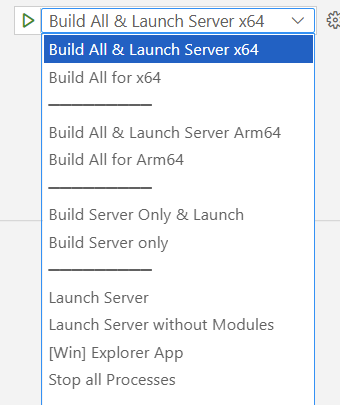
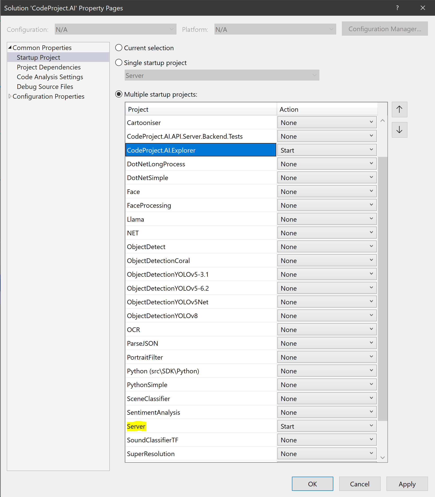

{width="30" .middle} Windows &nbsp;
{width="30" .middle} macOS &nbsp;
{width="30" .middle} Ubuntu &nbsp;
{width="25" .middle} Debian &nbsp;
{width="30" .middle} Visual Studio &nbsp;
{width="30" .middle} VS Code


# Setting up the Development Environment

A quick guide to setting you up for Debugging, testing and adding your own additions to CodeProject.AI.

This current release works in Visual Studio Code on Windows 10+. Ubuntu and macOS (both Intel and 
Apple Silicon), and even directly on a Raspberry Pi or Jetson. Visual Studio 2019+ on Windows 10+ is also supported.


<center>

[Download the Latest code](https://www.codeproject.com/Articles/5322557/CodeProject-AI-Server-AI-the-easy-way){ .md-button .md-button--primary }
&nbsp; &nbsp; &nbsp;
[Fork on GitHub](https://github.com/codeproject/CodeProject.AI-Server.git){ .md-button  }

</center>

## Download and Setup the code:

1. [Download the code](https://www.codeproject.com/Articles/5322557/CodeProject-AI-Server-AI-the-easy-way) from CodeProject, or clone the [CodeProject.AI repository](https://github.com/codeproject/CodeProject.AI-Server.git) from GitHub

2. In the Solution folder go to /src folder and run the installation scripts:
    1. For Windows: `setup.bat` 
    2. For Ubuntu and macOS: `bash setup.sh`
    
    This will download required assets and setup the runtime environments.

## Development using Visual Studio Code

You'll need the following extensions

1. [Python extension for Visual Studio Code](https://marketplace.visualstudio.com/items?itemName=ms-python.python)

2. [C# extension for Visual Studio Code](https://marketplace.visualstudio.com/items?itemName=ms-dotnettools.csharp).


### To Build and Debug

1. Open the main application folder in VS Code

2. Click the "Run and Debug" button on the left hand tab bar (the arrow)

3. From the dropdown at the top of the window, select **Build All & Launch Server**. Select x64 for
x86_64 chips (eg Intel, AMD), or Arm64 for Apple Silicon or Raspberry Pi.

    {width="400"}

4. Click the green arrow next to the dropdown

The dashboard webpage should launch after the code has built and the server has started.

### Using the Windows Subsystem for Linux?

The Windows Subsystem for Linux (WSL) may first need to be installed on your Windows machine. 
Installing is as simple as opening a Powershell terminal and entering

```powershell
wsl --install
```

More information can be found in [Microsoft's guide](https://docs.microsoft.com/en-us/windows/wsl/install). 

You will also need to install Visual Studio Code for Ubuntu. The downloads for each platform are at
[Visual Studio Code Download page](https://code.visualstudio.com/download). For WSL select Ubuntu, 64 bit 
(under "Debian, Ubuntu" select '64 bit')

Once you have WSL and VS Code installed, you will also need to install the following VS code extensions:

1. The [Remote WSL Extension](https://marketplace.visualstudio.com/items?itemName=ms-vscode-remote.remote-wsl).

2. The [C# Extension](https://marketplace.visualstudio.com/items?itemName=ms-dotnettools.csharp) 
   for WSL, even if you've already installed it for Windows.
   
    Open an Ubuntu Terminal (we strongly recommend [Windows Terminal](https://apps.microsoft.com/store/detail/windows-terminal/9N0DX20HK701?hl=en-us) for this) and type `code .`. Then head to the
    [C# Extension page](https://marketplace.visualstudio.com/items?itemName=ms-dotnettools.csharp), 
    choose install, and the extension should be installed. If you get a warning that there is an 
    instance of VS Code already running, close VS code and hit the install button again.

3. You probably want to also install a browser. For Google Chrome use

   ```bash
   wget https://dl.google.com/linux/direct/google-chrome-stable_current_amd64.deb
   sudo apt -y install ./google-chrome-stable_current_amd64.deb
   ```

Once you have VSCode installed and have cloned the project, setup the development environment as if you were in a native Linux environment.

**A word of warning** In WSL you can have multiple Linux instances. Be sure that if you open a terminal outside of VSCode that it's running on the same
instance as that VSCode is using for its integrated terminal.

You're now ready to edit and Debug CodeProject.AI inside WSL using VS Code. 

For this demo we will use **the same solution files we use in Windows.** Editing 
and debugging the *same* files in Windows and in Linux makes life easy. Just be 
careful of those CRLF vs LF line endings.

1. Navigate to your repo and launch VS Code. If your solution is in 
  `C:\Dev\CodeProject\CodeProject.AI` then you would use

    ``` shell
    cd /mnt/c/Dev/CodeProject/CodeProject.AI
    code .
    ```

2. **Re**-open in WSL by hitting <kbd>Ctrl+Shift P</kbd> for the command pallete, select "Remote-WSL: Reopen Folder in WSL" and hit enter.

You are now coding against the existing Windows repository, but using a remote connection to the WSL system from within VS Code. From within this current environment it's all Linux. Run the setup scripts (the
Linux version) and you're on your way. Easy, right?

## Development using Visual Studio 2019 or later

1. Open the solution in Visual Studio and build the entire solution
2. Start a new instance of the `/src/server` project

The dashboard should appear and you're on your way.

You may wish to have the Python workflow enabled in Visual Studio. While not critical, it does 
help with debugging.

### To run and debug the Server and the demo .NET application 

There are two ways you can do this:

1. Separately start both the projects in debug mode: 

    1. In Solution Explorer, open demos / clients / .NET and right-click on `CodeProject.AI.Explorer` and choose Debug -> Start new instance.
    2. In Solution Explorer, open src / server and right-click on `Server` and choose Debug -> Start new instance. 
         
2. Configure Visual Studio to start multiple projects:

    1. In Solution Explorer, right-click on the solution and select **Set Startup Projects...**. 
       The Solution property page will appear
   
          

    2. Check "Multiple Startup Projects" and select the `Server` and 
       `CodeProject.AI.Explorer` projects.

    Now when you start with or without debugging, both the Server and demo projects with start.
