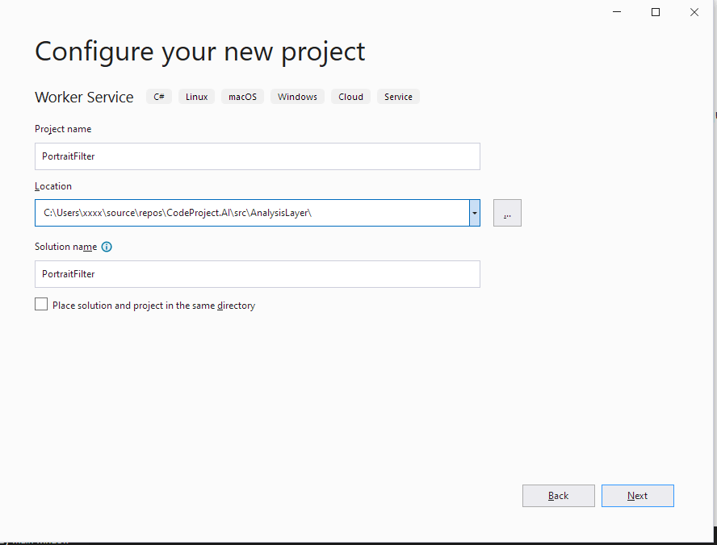
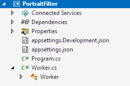
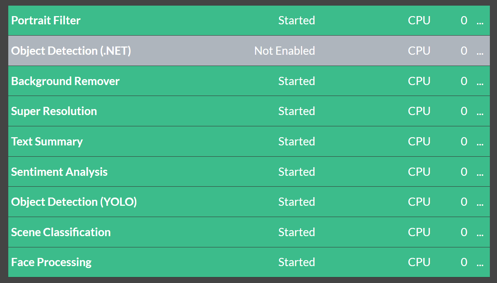
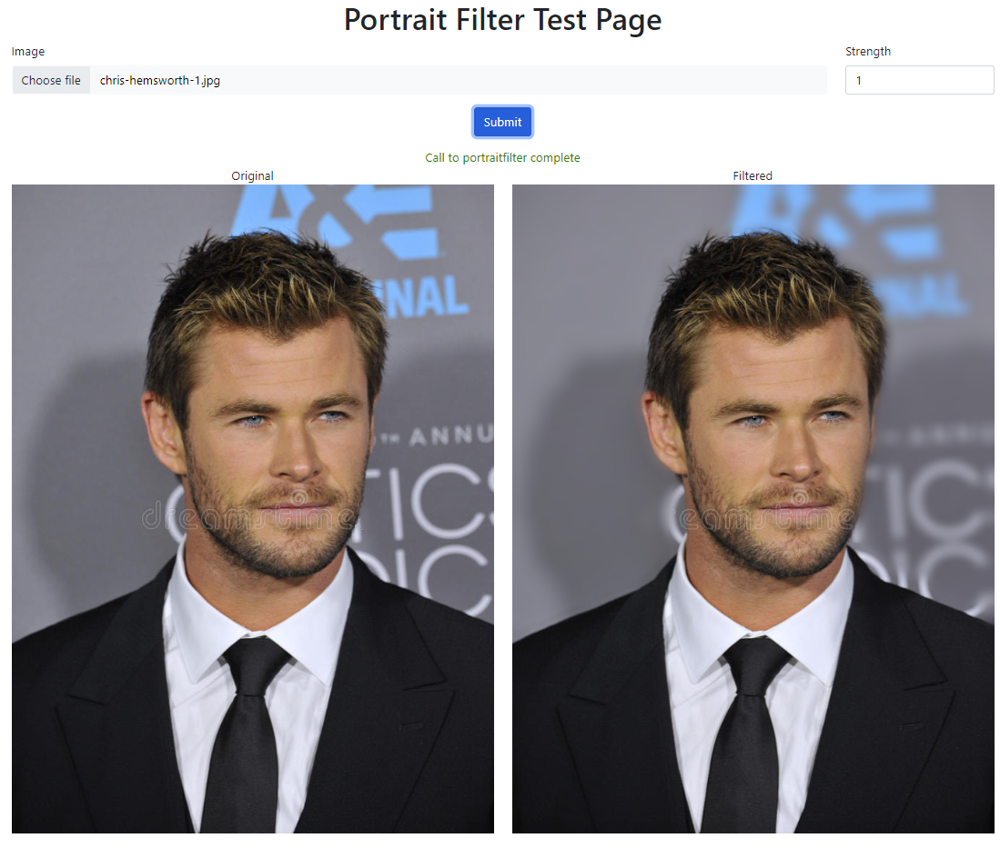

## Introduction

This article will show how to create a Module in .NET for the CodeProject.AI Server by adapting
existing code and adding an adapter so that the functionality of the original code is exposed as 
an HTTP endpoint by the CodeProject.AI Server. The process is similar to
[Adding your own Python module to CodeProject.AI](add_python_module.md), except we'll be using .NET instead
pf Python and go a little deeper into some of the gotchas you may encounter.

Again: ensure you've read [Adding new modules to CodeProject.AI](adding_new_modules.md] before you start.


## Choosing a module

You can write your own module from scratch, or use one of the large number of Open Source AI projects currently available. There are thousands out there and for this article I chose the
[Portrait Mode](https://github.com/asiryan/Portrait-mode">) project on GitHub written by Valery Asiryan. This project takes an image as an input, detects the people in it, and blurs the background behind them. The result is returned as an image. An easy way to up your selfie game.

An example of the `Portrait Mode` in action from the GitHub repository with the original (left) and result (right)

{width=300}{width=300}

## Writing the Module

This tutorial assumes that you have already cloned the CodeProject.AI repository from GitHub. This is located at <a href="https://github.com/codeproject/CodeProject.AI-Server">https://github.com/codeproject/CodeProject.AI-Server</a>.

To get the code we are going to include in our module, clone the <a href="https://github.com/asiryan/Portrait-mode">`Portrait Mode`</a> project on from GitHub to a directory of your choice.

### Review the Repository Code
Looking at the code, we see that the project consists of a Windows Form, Form1.cs, and the code to perform the background blurring. For our purposes, we do not need the Form. All we need are the 3 files located in the `cscharp\Lib` directory and the ONNX model file located in the `deeplabv3_mnv2_pascal_train_aug_2018_01_29` directory

### Create a new Module Project
When you write a CodeProject.AI Module in NET 7, you are creating something that polls the CodeProject.AI 
Server for commands from a queue created for the module. The easiest way to do this is to create a
**Worker Service** project in a folder under the `src/modules`. The **CodeProject.AI Server** scans
the directories in this folder for Module metadata which allows the server to start the Modules.

The steps to do this are:

- Right click on the **src/modules** folder in the Solution Explorer
    - Select `Add` -> `New Project`
    - Select the **Worker Service** project template for C#
    - Click `Next`

- This will open the `Project Configuration` dialog<br><Br>


    - Set the `Project Name` to **PortrailFilter**
    - Set the `Location` to the **src\modules** directory in your copy of the CodeProject.AI solution.
    - click `Next`. 

- This will open the `Additional Information` dialog<br><br>

    - We don't need to change anything here, so click `Create`.

- This will create the project with the following structure  <br><br>


### Copy Code from the Repository

Since we only need the library code from the original `Portrait Mode` repo, we will create a folder called `Lib` to hold this code.  
- Right click on the `PortraitFilter` project
    - Select `Add` -> `New Folder`
    - Name the folder `Lib`.
- Copy the relevant code from the `Portrait Mode` repo.
    - Right click on the `Lib` folder
    - Select `Add` -> `Existing Item`
    - Navigate to you copy of the `Portrait Mode` repo and the `csharp\Lib` directory
    - Select all the files and click `Add` to copy the code into the new project
- Copy the AI model from the `Portrait Mode` repo.
    - Right click on the `Lib` folder
    - Select `Add` -> `Existing Item`
    - Navigate to you copy of the `Portrait Mode` repo and the `deeplabv3_mnv2_pascal_train_aug_2018_01_29` directory
    - Select `All Files` in the file filter at the bottom right
    - Select the `.onnx` file and click `Add` to copy the modle into the new project


### Add the required NuGet packages

If you were to build the project now, you would get a bunch of errors about missing types or namespaces. This is due to missing NuGet packages used by the code we just copied into the project. This is solved by:

- Right click on the `PortraitFilter` project and select `Manage NuGet Packages...`. This will open a window where you can, as it says, manage your NuGet packages.
- Add the following packages
    - `Microsoft.ML.OnnxRuntime` for running the `ONNX` model
    - `UMapX` - for performing operations on the images.
- Building now will result in error complaining about compiling unsafe code. To allow this
    - Right click on the `Portrait Filter` project and select `Properties`.
    - Check the `Allow code that uses the unsafe keyword to compile`.
- Building now will result in a `'Maths' does not contain a definition for 'Double'` error. This is due to changes in `UMapX` from the version the `Portrait Mode` repo used and the current version. Correct this by changing the changing the type of `Strength` from `Double` to `Float` in the  `PortraitModeFilter.cs` file in the `Lib` directory. 
- change the type of the `_strength` field to `float` on line 17
- change the type of the `strength` parameter to `float` on line 25
- change the type of the Strength property to float on line 35
- change the call to `Maths.Double` to `Maths.Float` on line 43. This is the UMapX change in the its API the required these changes.

```csharp
using System.Drawing;
using UMapx.Core;
using UMapx.Imaging;

namespace CodeProject.AI.Modules.PortraitFilter
{
    /// <summary>
    /// Defines "portrait mode" filter.
    /// </summary>
    public class PortraitModeFilter
    {
        #region Private data
        BoxBlur _boxBlur;
        AlphaChannelFilter _alphaChannelFilter;
        Merge _merge;
        float _strength;
        #endregion

        #region Class components
        /// <summary>
        /// Initializes "portrait mode" filter.
        /// </summary>
        /// <param name="strength">Strength</param>
        public PortraitModeFilter(float strength)
        {
            _boxBlur = new BoxBlur();
            _alphaChannelFilter = new AlphaChannelFilter();
            _merge = new Merge(0, 0, 255);
            _strength = strength;
        }
        /// <summary>
        /// Gets or sets strength.
        /// </summary>
        public float Strength
        {
            get
            {
                return _strength;
            }
            set
            {
                _strength = Maths.Float(value);
            }
        }
        ...
```

Building now should result in no errors.

### Create the modulesettings.json file

To provide the CodeProject.AI Server with enough information to launch and service our module we need to
create the modulesettings.json file. This will define the name of the module, how to start it,
what queue to setup and process, and the routes that should be watched for requests to this module.

Our runtime will be .NET, and we'll set our queue name as `portraitfilter_queue`. The route for
this module will be /v1/image/portraitfilter, and will have two inputs, a File with an named 
"image", and Float value with a named "strength". There will be  two outputs, a Boolean value named "success", and the resulting image File named "filtered_image".

Below is the contents of our `modulesettings.json` file. Note that we're only supporting Windows
for this module due to issues with the Onnx and drawing libraries we're using. Portint to Linux and
macOS is an exercise for the reader.

```json
{
  "Modules": {
    "PortraitFilter": {
      "Name": "Portrait Filter",
      "Version": "1.1",

      "Description": "Provides a depth-of-field (bokeh) effect on images. Great for selfies.", 
      "Platforms": [ "windows" ], 
      "License": "MIT",
      "LicenseUrl": "https://opensource.org/licenses/MIT",

      // Launch instructions
      "AutoStart": true,
      "FilePath": "PortraitFilter.exe",
      "Runtime": "execute",

      // Which server version is compatible with each version of this module.
      "ModuleReleases": [
        { "ModuleVersion": "1.1", "ServerVersionRange": [ "2.1", "" ], "ReleaseDate": "2023-03-20" }
      ],
      
      "RouteMaps": [
        {
          "Name": "Portrait Filter",
          "Path": "image/portraitfilter",
          "Command": "filter",
          "Description": "Blurs the background behind people in an image.",
          "Inputs": [
            {
              "Name": "image",
              "Type": "File",
              "Description": "The image to be filtered."
            }, 
            {
              "Name": "strength",
              "Type": "Float",
              "Description": "How much to blur the background 0.0 - 1.0.",
              "DefaultValue": "0.5"
            }
          ],
          "Outputs": [
            {
              "Name": "success",
              "Type": "Boolean",
              "Description": "True if successful."
            },
            {
              "Name": "filtered_image",
              "Type": "Base64ImageData",
              "Description": "The filtered image."
            }
          ]
        }
      ]
    }
  }
}
```
Because the location of the executable in the Development environment is different that the Production environment, we need to create a `modulesettings.development.json` file that overrides the 
FilePath value when run in Debug.  

This file overrides some of the `modulesettings.json` file values for the Development environment. In this case, the location of the executable will be found in the `bin\debug\net6.0` directory rather than the Module's root folder, so we force the working directory to be the directory of the module, and update the location of the file to execute, relative to the module's folder.
```json
{
    "Modules": {
        "PortraitFilter": {
           "FilePath": "bin\\debug\\net7.0\\SentimentAnalysis.exe"
        }
    }
}
```

### Create the Background Worker

The next step is to create the Background Worker. This will poll the **CodeProject.AI Server** for commands, process any commands it finds, and return the result to the **CodeProject.AI Server**.

The Worker will use the CodeProject.AI .NET SDK to communicate with the **CodeProject.AI Server** and process the request and response values.  Add a Project Reference to the `CodeProject.AI.SDK` project. This is a preliminary implementation and will change in the future, mainly to add features, so this code will require minimal changes going forward.

#### Add required references

In addition, we will be using the SkiaSharp library to provide cross platform graphics support as well as support for images not supported by the Windows `System.Drawing` library. Add the following NuGet packages to the project:

  - `SkiaSharp.Views.Desktop.Common` to include the SkiaSharp core and interoperability with System.Drawing.
  - `SkiaSharp.NativeAssets.Linux` to provide support when running under Linux.

#### Create the PortraitFilter Worker

Open the Worker.cs file and to the following:
   - rename the class to `PortraitFilterWorker`. The file should now look like  

```csharp
namespace CodeProject.AI.Modules.PortraitFilter
{
    public class PortraitFilterWorker : ModuleWorkerBase
    {
        private readonly ILogger<PortraitFilterWorker> _logger;

        /// <summary>
        /// Initializes a new instance of the PortraitFilterWorker.
        /// </summary>
        /// <param name="logger">The Logger.</param>
        /// <param name="deepPersonLab">The deep Person Lab.</param>
        /// <param name="configuration">The app configuration values.</param>
        public PortraitFilterWorker(ILogger<PortraitFilterWorker> logger,
                                    IConfiguration configuration)
            : base(logger, configuration)
        {

        public override BackendResponseBase ProcessRequest(BackendRequest request)
        {
        }
    }
}
```

  - Ensure that the `Program.cs` file has also been updated

```csharp
using CodeProject.AI.Modules.PortraitFilter;

IHost host = Host.CreateDefaultBuilder(args)
    .ConfigureServices(services =>
    {
        services.AddHostedService<PortraitFilterWorker>();
    })
    .Build();

await host.RunAsync();
```

  - Add the following using statements at the top of the file to reference the libraries and projects this class needs.

```csharp
using System.Drawing;
using CodeProject.AI.SDK;

using Microsoft.ML.OnnxRuntime;

using SkiaSharp;
using SkiaSharp.Views.Desktop;
```

  - At the top of the namespace add a definition for the response that will be returned to the `CodeProject.AI Server`. The BackendSuccessResponse base class is defined in the SDK and provides the boolean "success" property. The JSON serializer will encode the byte[] filtered_image value to Base64.

```csharp
namespace CodeProject.AI.Modules.PortraitFilter
{
    class PortraitResponse : BackendSuccessResponse
    {
        public byte[]? filtered_image { get; set; }
    }
```

  - Next, we will derive our class from the SDK's `ModuleWorkerBase` class and
  add some fields that will be use in the class.
    - `_modelPath` which defines the location of the ONNX model.
    - `_defaultQueueName` which identifies the default queue from which this module will pull its requests. Used only if it's not passed in by the server.
    - `_defaultModuleId` which is a default unique identifier for this module.
    - `_moduleName` which is a default name for this module.
    - `_deepPersonLab` which will hold a reference to the code we imported from the `Portrait Mode` repo.


```csharp
public class PortraitFilterWorker : ModuleWorkerBase
{
    private const string _modelPath = "Lib\\deeplabv3_mnv2_pascal_train_aug.onnx";
    private DeepPersonLab? _deepPersonLab;
```

  - Create the class constructor to initialize the fields. Note that when creating the `DeepPersonLab` instance, the `_modulePath` has the directory separator characters adjusted for the platform on which we are running. The 
    GetSessionOptions method provides an opportunity to setup GPU support for
    the module. This is outside of the scope of this article for now.

```csharp
public PortraitFilterWorker(ILogger<PortraitFilterWorker> logger,
                            IConfiguration configuration)
    : base(logger, configuration, _moduleName, _defaultQueueName, _defaultModuleId)
{
    string modelPath = _modelPath.Replace('\\', Path.DirectorySeparatorChar);

    // if the support is not available for the Execution Provider DeepPersonLab will throw
    // So we try, then fall back
    try
    {
        var sessionOptions = GetSessionOptions();
        _deepPersonLab = new DeepPersonLab(modelPath, sessionOptions);
    }
    catch
    {
        // use the defaults
        _deepPersonLab = new DeepPersonLab(modelPath);
        ExecutionProvider = "CPU";
        HardwareType      = "CPU";
    }
}

private SessionOptions GetSessionOptions()
{
    var sessionOpts = new SessionOptions();

    // add GPU support here if you wish

    sessionOpts.AppendExecutionProvider_CPU();
    return sessionOpts;
}

// Override if you have updated graphics hardware to report to the server
protected override void GetHardwareInfo()
{
}
```

  - When the `PortraitFilterWorker` is run, the `ProcessRequest` method will be called each time a request is placed on the queue for this module. Our `ProcessRequest` method will process this request, and return the results.
    The server will handle the communication back to the client.
    
    Replace the existing `ExecuteAsync` method with

```csharp
public override BackendResponseBase ProcessRequest(BackendRequest request)
{
    if (_deepPersonLab == null)
        return new BackendErrorResponse(-1, $"{ModuleName} missing _deepPersonLab object.");

    // ignoring the file name
    var file        = request.payload?.files?.FirstOrDefault();
    var strengthStr = request.payload?.values?
                                        .FirstOrDefault(x => x.Key == "strength")
                                        .Value?[0] ?? "0.5";

    if (!float.TryParse(strengthStr, out var strength))
        strength = 0.5f;

    if (file?.data is null)
        return new BackendErrorResponse(-1, "Portrait Filter File or file data is null.");

    Logger.LogInformation($"Processing {file.filename}");

    // dummy result
    byte[]? result = null;

    try
    {
        var portraitModeFilter = new PortraitModeFilter(strength);

        byte[]? imageData = file.data;
        Bitmap? image     = GetImage(imageData);

        if (image is null)
            return new BackendErrorResponse("Portrait Filter unable to get image from file data.");

        Stopwatch stopWatch = Stopwatch.StartNew();
        Bitmap mask = _deepPersonLab.Fit(image);
        stopWatch.Stop();

        if (mask is not null)
        {
            Bitmap? filteredImage = portraitModeFilter.Apply(image, mask);
            result = ImageToByteArray(filteredImage);
        }
    }
    catch (Exception ex)
    {
        return new BackendErrorResponse($"Portrait Filter Error for {file.filename}: {ex.Message}.");
    }

    if (result is null)
        return new BackendErrorResponse("Portrait Filter returned null.");
            
    return new PortraitResponse { 
        filtered_image = result,
        inferenceMs    = sw.ElapsedMilliseconds
    };
}
```

  - Additionally we need to add a few methods to the end of the class to
    1. output to the log when the worker shuts down.
    2. create a Bitmap from the request data
    3. convert an Image to a byte[]

```csharp
// Using SkiaSharp as it handles more formats.
private static Bitmap? GetImage(byte[] imageData)
{
    if (imageData == null)
        return null;

    var skiaImage = SKImage.FromEncodedData(imageData);
    if (skiaImage is null)
        return null;

    return skiaImage.ToBitmap();
}

public static byte[]? ImageToByteArray(Image img)
{
    if (img is null)
        return null;

    using var stream = new MemoryStream();

    // See https://github.com/dotnet/designs/blob/main/accepted/2021/system-drawing-win-only/system-drawing-win-only.md
#pragma warning disable CA1416 // Validate platform compatibility
    img.Save(stream, System.Drawing.Imaging.ImageFormat.Png);
#pragma warning restore CA1416 // Validate platform compatibility

    return stream.ToArray();
}
```

That's all the code that is needed to get a fully functional AI Module created for **CodeProject.AI Server.**  This code is included in the public <a href="https://github.com/codeproject/CodeProject.AI-Server">https://github.com/codeproject/CodeProject.AI-Server</a> GitHub repo.

### Testing with the Debugger

When you run the **CodeProject.AI Server** in the debugger, the Server will detect the module because:

  - it is in a subdirectory of src\AnalysisLayer
  - it has a modulesettings.json file

The Server will start all the modules it finds and have AutoStart=true in the configuration. The Dashboard will start and after a few seconds you should see  



#### Running on Linux

The module uses `System.Drawing` objects and methods

As of NET 6, System.Drawing is not officially supported on non-Windows platforms as documented in https://docs.microsoft.com/en-us/dotnet/core/compatibility/core-libraries/6.0/system-drawing-common-windows-only. Running on Linux can enabled by creating a runtimeconfig.json file with the following contents
```json
{
   "configProperties": {
      "System.Drawing.EnableUnixSupport": true
   }
}
```
Also SkiaSharp has dependencies on a couple of libraries that may not be installed by default on you Linux installation. if you get the error 
> System.TypeInitializationException: The type initializer for 'SkiaSharp.SKAbstractManagedStream' threw an exception. ---> System.DllNotFoundException: Unable to load shared library 'libSkiaSharp' or one of its dependencies.

Then you need to install the missing dependencies

```bash
apt-get install -y libfontconfig1
apt-get install -y libgdiplus
```

### Create a test.html file.

While this module is currently included in the install as of v1.3.0 with support in the **CodeProject.AI Playground** page, for new modules you would create a simple test page to send a request to the CodeProject.AI Server and display the response.

I have include one such file, test.html, in the project. I displays a simple form the allows the user to select an image, set the blur strength and submit the form. The returned response is displayed. It include all the JavaScript code required to send the form to the Server and display the Base64 encoded image response. This is listed below.

Just start the Server in the debugger and open the test.html file.

```html
<!DOCTYPE html>

<html lang="en" xmlns="http://www.w3.org/1999/xhtml">
<head>
    <!-- Required meta tags -->
    <meta charset="utf-8">
    <meta name="viewport" content="width=device-width, initial-scale=1">

    <title>Portrait Filter Test Page</title>

    <!-- Bootstrap 5 CSS only -->
    <link href="https://cdn.jsdelivr.net/npm/bootstrap@5.1.3/dist/css/bootstrap.min.css" rel="stylesheet"
          integrity="sha384-1BmE4kWBq78iYhFldvKuhfTAU6auU8tT94WrHftjDbrCEXSU1oBoqyl2QvZ6jIW3"
          crossorigin="anonymous">
    <script type="text/javascript">
        const apiServiceUrl = "http://localhost:32168";

        function setStatus(text, color) {
            if (color)
                document.getElementById("status").innerHTML = "<span style='color:" + color + "'>" + text + "</span>";
            else
                document.getElementById("status").innerHTML = "<span>" + text + "</span>";
        }

        function submitRequest(controller, apiName, images, parameters, doneFunc) {

            setStatus("Sending request to AI server", "blue");

            var formData = new FormData();

            // Check file selected or not
            if (images && images.length > 0) {
                for (var i = 0; i < images.length; i++) {
                    file = images[i];
                    formData.append('image' + (i + 1), file);
                }
            }

            if (parameters && parameters.length > 0) {
                for (var i = 0; i < parameters.length; i++) {
                    keypair = parameters[i];
                    formData.append(keypair[0], keypair[1]);
                }
            }

            var url = apiServiceUrl + '/v1/' + controller + '/' + apiName;

            //result.innerHTML = "";

            fetch(url, {
                method: "POST",
                body: formData
            })
                .then(response => {
                    if (!response.ok)
                        setStatus('Error contacting API server', "red");
                    else {
                        response.json().then(data => {
                            if (data) {
                                doneFunc(data)
                                setStatus("Call to " + apiName + " complete", "green");
                            } else
                                setStatus('No data was returned', "red");
                        })
                            .catch(error => {
                                setStatus("Unable to read response: " + error, "red");
                            })
                    }
                })
                .catch(error => {
                    setStatus('Unable to complete API call: ' + error, "red")
                });
        }

        function onSubmit(image, strength) {
            if (image.files.length == 0) {
                alert("No file was selected for scene detection");
                return;
            }

            var images = [image.files[0]];
            filteredImage.src = "";

            submitRequest("image", "portraitfilter", images, [["strength", strength.value]], function (data) {
                // alert("got response");
                filteredImage.src = "data:image/png;base64," + data.filtered_image;
            });
        }

        function onFileSelect(image) {
            if (image.files.length == 0) {
                originalImage.src = "";
                return;
            }

            originalImage.src = URL.createObjectURL(image.files[0]);
            filteredImage.src = "";
        }

        function onStrengthChange() {
            filteredImage.src = "";
        }
    </script>

</head>
<body>
    <div class="container">
        <h1 class="text-center">Portrait Filter Test Page</h1>
        <form method="post" action="" enctype="multipart/form-data" id="myform">
            <div class="row">
                <div class="mb-3 col">
                    <label class="form-label">Image</label>
                    <input class="form-control btn-light" id="image" type="file" onchange="onFileSelect(image)" />
                </div>
                <div class="mb-3 col-2">
                    <label class="form-label">Strength</label>
                    <input class="form-control" id="strength" type="number" min="0.0" max="1.0" step="0.1" value="0.5" 
                           onchange="onStrengthChange()"/>
                </div>
            </div>
            <div class="row">
                <div class="mb-3 text-center">
                    <input class="btn btn-primary" type="button" value="Submit" onclick="onSubmit(image, strength)" />
                </div>
            </div>
        </form>
        <div id="status" class="text-center"></div>

        <div class="row">
            <label id="originallbl" class="col-6 text-center">Original</label>
            <label id="filteredlbl" class="col-6 text-center">Filtered</label>
        </div>
        <div class="row">
            
            
        </div>
    </div>
    <!-- Bootstrap 5 JavaScript Bundle with Popper -->
    <script src="https://cdn.jsdelivr.net/npm/bootstrap@5.1.3/dist/js/bootstrap.bundle.min.js"
            integrity="sha384-ka7Sk0Gln4gmtz2MlQnikT1wXgYsOg+OMhuP+IlRH9sENBO0LRn5q+8nbTov4+1p"
            crossorigin="anonymous"></script>
</body>
</html>
```
And it will look something like this


## Added Bonus - Bin deploy Module on Windows.

NET 6 modules do not depend on the installation of any runtimes or the setup of virtual environments the same way Python modules are. The NET 6 runtime is already installed by the **CodeProject.AI Server** installer. Because of this, the Release version of the build can be bin deployed into an existing Windows installation of the **CodeProject.AI Server**. The steps to do this are:

  - Build the module project in `Release` mode.
  - Create a folder in the `c:\Program Files\CodeProject\eAI\AnalysisLayer` directory. This directory should have the same name as the FilePath's directory in the `modulesettings.json` file. For this example that would be "PortraitFilter".
  - Copy the contents of the project's bin\Release\net6.0 directory to the directory created in the previous step.
  - Using the `Service` app, restart the **CodeProject.AI Server** service. The new module will now be expose on the endpoint defined in the modulesettings.json file.