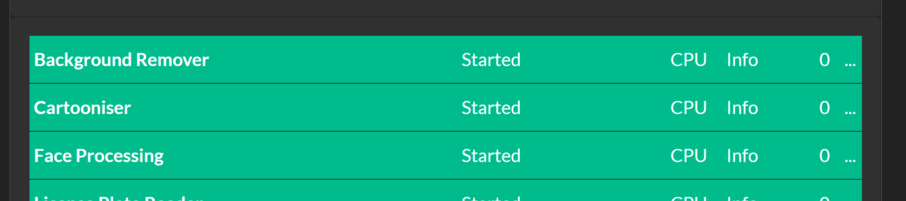
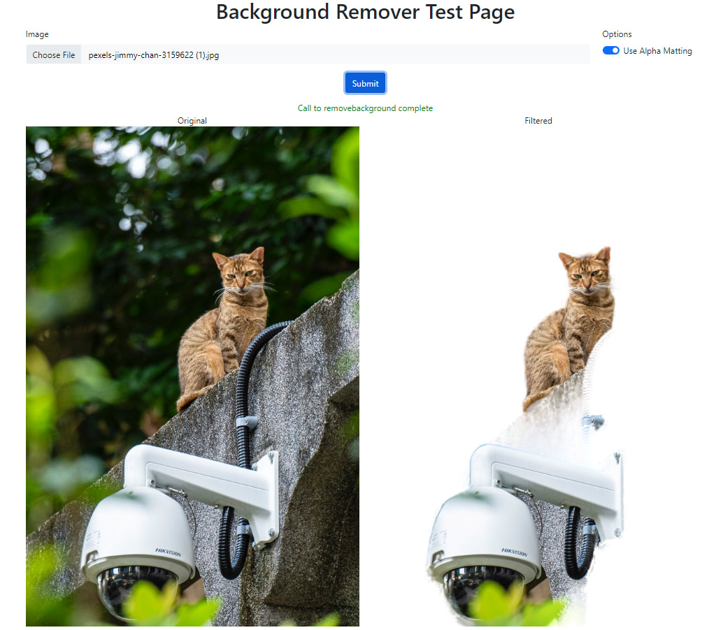

## Adding your own Python module to CodeProject.AI

Recall from [Adding new modules to CodeProject.AI](adding_new_modules.md) that there are 6 main 
tasks for adding a module (in development mode) to CodeProject.AI server

1. **Find or write the code you want to include**. This could be a project you find online,
a project you've written yourself you wish to include, or you might just start from scratch
on a new project.
2. **Write an adapter** that handles communication between the AI code you've written or are
including in the module, and the CodeProject.AI server itself.
3. **Provide a `modulesettings.json` file** that describes the module and provides instruction
   to CodeProject.AI on how to launch the module.
4. **Create an install script** (usually short) to setup the pre-requisites (download models, install necessary runtimes)
5. (Optional but recommended) **Create a simple `explore.html` file** for testing your module, and to provide integration with the CodeProject.AI Explorer
6. (Optional but recommended) **Create a packager** so your module can be packaged up and included in the main CodeProject.AI registry.

We'll walk through each of these steps below, but first let's cover how a module communicates with
the rest of the world. 

### How does a client of CodeProject.AI Server know how to call a given module?

Each module defines a route in the form of `category/operation/command`. For instance, a computer
vision module that offers object detection using a model called "animals" might define a route
`vision/detect/animals`. This route is specified in the module's `modulesettings.json` file. The
server takes care of the routing. A module can have as many routes as it wishes.

### How does the client know what input/output to provide, and hows does that get to and from the module?

Again, the `modulesettings.json` defines the input/output for each route for each module. It is up
to the client to make a HTTP POST call to CodeProject.AI Server using the module's route (explained
above) and a request body that has the name/value pairs the module is expecting. This HTTP call is
then converted to a `RequestData` object and passed to the module, and the module, in turn, uses 
`RequestData` methods to get values and files from this object. 

Once the module has the input data, it processes that data using its `process` method and then passes
the results back to the server as a JSON package. The return data is documented in the `modulesettings.json` file, but there
are no hard and fast rules on what should be returned, apart from a requirement that the response must include a `success` flag
to indicate whether the inference operation succeeded. 

The server itself will also add data to this
return package such as timing data and meta data such as the name of the module that processed the request.

What this boils down to is the `process` method should accept a `RequestData` object and return a 
`JSON` object.

For long running processes, a module may simply return a 'succeeded' message as the return response,
and the server can then provide further updates on the progress of the request via a `status` method.
This is a subject for another article.

## Choosing the code you will add as a module

We want a module that will drop in easily, be self contained, and which will work within the current
ecosystem of Python and / or .NET on Windows, macOS and Ubuntu.

For this demonstration we'll use the [rembg](https://github.com/danielgatis/rembg) module. `rembg` is
a simple but fun AI module that takes any photo containing a subject and removes the background from
the image. It runs under Python 3.9 or above. It exposes a simple API, works offline, and is fully 
self-contained.

## Writing the Module

<!--
To create an adapter we need to ensure there is a well-defined package of data we can send to the module (eg an image, or some text), and a well-defined response from the server (again, maybe some text or an image). We want our module to be self contained and not require any user intervention. 

For this example our payload will be an image and a boolean value that determines whether alpha matting will be used. Alpha matting is useful when dealing with images with softer edges. 

The return package will be the modified image. We're passing information back via JSON, so we'll be base64 encoding the image.

### The CodeProject.AI Server SDK
-->

To make writing a module simpler and faster we'll use the CodeProject.AI Server's Python SDK and create
a child class of the `ModuleRunner` class. This class provides 5 methods for overriding (though only 1
is mandatory) and takes care of all the plumbing to handle the communication with the server. 

These methods are:

  - `initialise` (optional) - This provides module initialisation (if any is needed)
  - `process` (**required**) - The does the actual processing of an AI request. 
  - `status` (optional) - Override this if you wish to provide status updates back to the server
  - `selftest` (optional) - This method is called at install time and provides a chance to test the system
  - `cleanup` (optional) - Provides a chance to clean up any resources in use while the module was running

For our example we'll add a `rembg_adapter.py` file to our project in order to create our
`ModuleRunner` class. This class will override the `process` and `selftest` methods only.  We'll then
drop in the code we grabbed from the original rembg project. To keep things neat we'll
drop all the rembg code into a rembg subfolder, and have our adapter at the root.

### What about Python packages and a Virtual Environment?

If we're working with Python then we should use a virtual environment and install all our Python
packages within this virtual environment. Happily that's all automatically done as part of the module
install process: All we need to do is specify that we're going to be using Python within the `modulesettings.json`
file (discussed below), and include a `requirements.txt file (also discussed below). The setup system
will ensure python is installed, create the virtual environment, and install all the Python packages 
for us. It will even check they installed properly and let us know if there was a problem.

When importing modules from your Virtual Environment you should ensure you include the CodeProject.AI
server SDK files first. This ensure the path to your installed modules is set correctly.

### Logging

There are logging methods that can be access in a module, but all output to stdout (eg console output) 
is captured by the server and displayed in the dashboard, so if your original code dumps stuff to console, 
that's fine: it will all be visible to the end user.

### The Code

The guts of the background remover are in the `rembg/bg.py` module so we'll need to import that into
our adapter, as well as the CodeProject.AI Server SDK, along with any other modules we need. We will
add the methods we'll be overriding, and fill in those methods as appropriate.

In our case there's no initialisation, no cleanup, and we won't pass back any status info (not a lot
to report, really), so that leaves us with `process` and `selftest`. 

The code for these is very simple. For `process` we will take the input data from the `RequestData`
object passed to us and extract a file and a value (named `use_alphamatting`) from this object. 
These two parameters will be listed in the modulesettings.json file, so we hope our client who made the call included these values.
If they didn't, the call will fail. Assuming all is good, we call the `remove` method from the original
rembg project, and send the result back to the server as a JSON object. Super simple.

The `selftest` method is equally simple. We create a `RequestData` object, fill it with test data,
call the `process` method, and report success or failure. Care must be take to
ensure that if environment variables are required, these will need to be set before the call is made.

Finally, we need to ensure our adapter starts up. This is done by via the `start_loop` method of the
Module runner

The final, complete code, is below.


```python
# Import our general libraries
import sys
import time

# Import the CodeProject.AI SDK. This will add to the PATH var for future imports
sys.path.append("../../SDK/Python")
from request_data import RequestData
from module_runner import ModuleRunner
from common import JSON

# Import modules we need from our virtual environment
from PIL import Image

# Import the method of the module we're wrapping
from rembg.bg import remove

class rembg_adapter(ModuleRunner):

    def process(self, data: RequestData) -> JSON:
        """ Processes a request from the client and returns the results"""
        try:
            # Get the input data. In this case an image and a bool value for the
            # 'use_alphamatting' param  
            img: Image             = data.get_image(0)
            use_alphamatting: bool = data.get_value("use_alphamatting", "false") == "true"

            # Make the call to the AI code we're wrapping (and time it)
            start_time = time.perf_counter()
            (processed_img, inferenceTime) = remove(img, use_alphamatting)
            processMs = int((time.perf_counter() - start_time) * 1000)

            # Return a JSON object
            return { 
                "success":      True, 
                "imageBase64":  RequestData.encode_image(processed_img),
                "processMs" :   processMs,
                "inferenceMs" : inferenceTime
            }

        except Exception as ex:
            self.report_error(ex, __file__)
            return {"success": False, "error": "unable to process the image"}

    def selftest(self) -> JSON:
        
        import os
        os.environ["U2NET_HOME"] = os.path.join(self.module_path, "models")
        file_name = os.path.join("test", "chris-hemsworth-2.jpg")

        request_data = RequestData()
        request_data.add_file(file_name)
        request_data.add_value("use_alphamatting", "true")

        result = self.process(request_data)
        print(f"Info: Self-test for {self.module_id}. Success: {result['success']}")
        # print(f"Info: Self-test output for {self.module_id}: {result}")

        return { "success": result['success'], "message": "Remove background test successful" }

if __name__ == "__main__":
    rembg_adapter().start_loop()
```

A couple of notes on this code:

1. We've used the ModuleRunner `report_error` method for reporting exceptions. This method takes the
   exception and the name of the current file and reports the error to the server. It handles all
   the formatting and stack tracing needed to provide a sensible error report.
2. We made one small (optional) change to the `remove` method in the rembg project to allows us
    to report on inference time. This isn't needed: it just is a nice touch

    In `/rembg/bg.py` we wrap the `masks = session.predict` line with some timing:
    ```python
    start_time = time.perf_counter()
    masks = session.predict(img)
    inference_time: int = int((time.perf_counter() - start_time) * 1000)
    ```
    and we return a tuple containing the modified image and the inference time
    ```python
    return (bio.read(), inference_time)
     ```
     This is the only code we've added. The rembg module has been copied and pasted as-is, and we're creating a child class of the ModuleRunner class in the CodeProject.AI SDK module module_runner.py. Nothing else (code-wise) needs to be added.


### The modulesettings.json file

We need to tell client applications how they will call our module, and the CodeProject.AI server what
route it needs to watch. This route can be whatever we like, so let's choose the route 
<code>/v1/image/removebackground</code>. 

Our module settings file (`modulesettings.json`) also allows us to define environment variables that 
are local to the process. Here, we'll let rembg know where the model file that we downloaded in the 
setup script is stored.

The module settings provides the server with publishing information that is used to create packages
and package listings, which in turn allows the dashboard to display human readable information such
as a description, version, author, the project that it's based on and licensing information.

Any custom menu that should be added to the module's listing's dropdown menu on the dashboard is
defined in the module settings file under the `Menus` object.

Finally, as the module evolves, and as the server itself evolves, version compatibility between
module and server is important. The `ModuleReleases` object defines what version of the module is
compatible with which server version.

Since this is a Python module we'll also set the runtime as Python3.9, and ask it to call our
adapter file to start the process.

```json
{
  "Modules": {

    "BackgroundRemover": {
      "Name": "Background Remover",
      "Version": "1.1.0",

      "PublishingInfo" : {
        "Description": "Automatically removes the background from a picture", 
        "IconURL": null,
        "Category": "Image Processing",
        "Stack": "Python, ONNX",
        "License": "SSPL",
        "LicenseUrl": "https://www.mongodb.com/licensing/server-side-public-license",
        "Author": "Chris Maunder",
        "Homepage": "https://codeproject.com/ai",
        "BasedOn": "rembg",
        "BasedOnUrl": "https://github.com/danielgatis/rembg"
      },

      "LaunchSettings": {
        "AutoStart": false,
        "FilePath": "rembg_adapter.py",
        "Runtime": "python3.9",
        "RuntimeLocation": "Local",       // Can be Local or Shared
        "PostStartPauseSecs": 0           // Generally 1 if using GPU, 0 for CPU
      },

      "EnvironmentVariables": {
        "U2NET_HOME": "%CURRENT_MODULE_PATH%/models" // where to store the models
      },
 
      "GpuOptions" : {
        "InstallGPU": false,              // GPU support not provided
        "EnableGPU": true,                // Will be coerced to false if InstallGPU = false
        "AcceleratorDeviceName": null,    // = default
        "Parallelism": 1,                 // 0 = Default (number of CPUs - 1)
        "HalfPrecision": "enable"         // 'Force', 'Enable', 'Disable': whether to force on, allow, or disable half-precision ops
      },

      "InstallOptions" : {
        "Platforms": [ "all", "!linux", "!raspberrypi", "!orangepi", "!jetson" ], // issues with numpy on linux
        "PreInstalled":   false,          // Is this module pre-installed with the server (eg Docker containers)
        "ModuleReleases": [               // Which server version is compatible with each version of this module.
          { "ModuleVersion": "1.0.0", "ServerVersionRange": [ "1.0",   "2.0.8"  ], "ReleaseDate": "2022-11-01" },
          { "ModuleVersion": "1.0.1", "ServerVersionRange": [ "2.0.9", "2.4.0"  ], "ReleaseDate": "2023-12-06", "ReleaseNotes": "Updated modulesettings schema", "Importance": "Minor" },
          { "ModuleVersion": "1.1.0", "ServerVersionRange": [ "2.4.0", ""       ], "ReleaseDate": "2023-12-09", "ReleaseNotes": "Installer updates" },
        ]
      },

      "RouteMaps": [
        {
           ...
        }
      ]
    }
  }
}
```

The **EnvironmentVariables** section defines key/value pairs that will be used to set environment
variables that may be required by the module. In this case, the path to the AI model files. This
is a value specific to, and defined by, the rembg module.

`CURRENT_MODULE_PATH` is a macro that will expand to the location of the directory containing the current module.
In this case /src/modules/BackgroundRemover.

The settings under "Launch instructions" section should be self-explanatory. The FilePath is the path
to the file to be executed, relative to the `MODULES_PATH` directory. AutoStart sets whether or not this module will
be launched at startup.

Runtime defines what runtime will launch the file. We currently support dotnet (.NET), python37
(python 3.7) and python39 (Python 3.9). If omitted, the CodeProject.AI Server will attempt to
guess based on the FilePath. RuntimeLocation refers to whether this module should have its runtime
(in this case the Python3.9 environment) setup locally to the module, or in a shared location where
libraries will be shared among multiple modules. Sharing saves space at the expense of compatibility
issues.

The Platforms array contains an entry for each platform on which the service can run.
Currently Windows, Linux, Linux-Arm64, macOS, and macOS-Arm64 are supported.

#### Routemaps

The file also defines the API routes for the module under the **RouteMaps** section

``` json
{
  "Modules": {
    "ModulesConfig": {
      "BackgroundRemoval": {
         "Name": "Background Removal",
         "Version": "1.0",
         "Description": "Removes backgrounds from images.",

         ...

      "RouteMaps": [
        {
          "Name": "Background Remover",
          "Route": "image/removebackground",
          "Method": "POST",
          "Command": "removebackground",
          "Description": "Removes the background from behind the main subjects in images.",
          "Inputs": [
            {
              "Name": "image",
              "Type": "File",
              "Description": "The image to have its background removed."
            },
            {
              "Name": "use_alphamatting",
              "Type": "Boolean",
              "Description": "Whether or not to use alpha matting.",
              "DefaultValue": "false"
            }
          ],
          "Outputs": [
            {
              "Name": "success",
              "Type": "Boolean",
              "Description": "True if successful."
            },
            {
              "Name": "imageBase64",
              "Type": "Base64ImageData",
              "Description": "The base64 encoded image that has had its background removed."
            },
            {
              "Name": "inferenceMs",
              "Type": "Integer",
              "Description": "The time (ms) to perform the AI inference."
            },
            {
              "Name": "processMs",
              "Type": "Integer",
              "Description": "The time (ms) to process the image (includes inference and image manipulation operations)."
            }
          ]
         ]
       }
     }
   }
}
```

Path is the API path, in this case _localhost:32168/v1/image/removebackground_. Remember that this
was what we chose (arbitrarily) as our API. It can be anything as long as it isn't currently in use.

Method is the HTTP method to use. In our case POST.

Command is the method in the API controller that will be called, in this case 
<code>removebackground</code>. Command is passed to the `process` method and is only needed if your
process method will handle more than one command.

 Description, Inputs and Outputs are purely documentation at this stage.


## Creating an installer script. Or two.

the `rembg` module comprises the following

1. The python code
1. The python 3.9 interpreter
1. Some Python packages
1. The AI models

To ensure these are all in place within the development environment we need to create an `install.bat`
install script in the folder containing our project. In our case we don't need to do anything other
than download models. The python runtime is setup automatically, as are the packages. There are no
libraries or drivers to install, so our install script is simple.

### For Windows (install.bat)

This script will be called automatically from the global `setup.bat` script

``` batch
:: Download the models and store in /models
call "%sdkScriptsPath%\utils.bat" GetFromServer "rembg-models.zip" "models" "Downloading Background Remover models..."
```

Obviously there's not a lot this script needs to do other than download the models
for the module.

When writing install scripts you have the following variables and methods at your disposal:

### Variables available:

| Variable | Description |
| :-- | :-- |
| absoluteAppRootDir | the root path of the app (default: C:\Program Files\CodeProject\AI) |t
| sdkScriptsPath     | the path to the installation utility scripts (%rootPath%\SDK\Scripts) |
| runtimesPath       | the path to the installed runtimes (%rootPath%/src/runtimes) |
| downloadPath       | the path to where downloads will be stored (%sdkScriptsPath%\downloads) |
| modulesPath        | the path to all the AI modules (%rootPath%\src\modules) |
| moduleDir          | the name of the directory containing this module (def: name of current dir) |
| os                 | "windows" for this script |
| architecture       | "x86_64" or "arm64" |
| platform           | "windows" for this script |
| verbosity          | quiet, info or loud. Use this to determines the noise level of output. |
| forceOverwrite     | if true then ensure you force a re-download and re-copy of downloads. GetFromServer will honour this value. Do it yourself for DownloadAndExtract   |

### Methods available (call by `call %sdkScriptsPath%\utils.bat <method>`)

| Method | Description |
| :-- | :-- |
|   Write     text [foreground [background]] | Writes text without a linefeed using the given colors (eg call %sdkScriptsPath%\utils.bat WriteLine "Hi" "green") |
|   WriteLine text [foreground [background]] | Writes text with a linefeed using the given colors 
|   GetFromServer filename moduleAssetDir message  | Downloads a file from the server and places it in the directory specified within the module's folder <br><ul><li>filename       - Name of the compressed archive to be downloaded<li>moduleAssetDir - Name of folder in module's directory where archive will be extracted<li>message        - Message to display during download  </ul>|
|   DownloadAndExtract  storageUrl filename downloadPath dirNameToSave message | Downloads a file from a remote server, unpacks it and stores it in the given folder <br><ul><li>storageUrl    - Url that holds the compressed archive to Download <li>filename      - Name of the compressed archive to be downloaded <li>downloadPath  - Path to where the downloaded compressed archive should be downloaded <li>dirNameToSave - name of directory, relative to downloadPath, where contents of archive will be extracted and saved <li>message       - Message to display during download</ul> |


### For Linux and macOS (install.sh)

The script is essentially the same as the Windows version:

``` bash
getFromServer "rembg-models.zip" "models" "Downloading Background Remover models..."
```

The variables and methods available in Linux / macOS are the same as in Windows, with the exception
that in Linux/macOS the methods are camelCased.

## Create a simple `explore.html` file

To test our module that's running under CodeProject.AI Server we'll write a simple webpage that will
call the module via its API and display the results. We do this using a special file `explore.html`
that will be written in a way that allows the CodeProject.AI Server's Explorer to extract the UI 
from this explore.html file and incorporate it into the server's main explorer.html file

The entire HTML file is shown below. Note the 3 sections marked by

1. START/END EXPLORER STYLE
2. START/END EXPLORER MARKUP
3. START/END EXPLORER SCRIPT

These three sections will be pulled out from this file and inserted into the main server's
explorer.html file. For this to work seamlessly it's best if your explore.html test file for this
module uses the same scripts and follows the same naming conventions as the explorer.html

Specifically

1. We include the explorer.js class to get access to the methods used to call the server API.
2. We include `imgPreview` and `imgMask` elements for displaying image results
3. We include a `results` element for displaying text results.
4. We prefix any IDs that may have naming conflicts with the `_MID_` macro. This marker will be
   replaced by the module's name in the main explorer.html file to avoid name collisions.


```html
<html>
<head>
    <meta charset="utf-8" />
    <title>Background Remover Module Test</title>

    <link id="bootstrapCss" rel="stylesheet" type="text/css" href="http://localhost:32168/assets/bootstrap-dark.min.css">
    <link rel="stylesheet" type="text/css" href="http://localhost:32168/assets/dashboard.css?v=2.5.0.0">
    <script type="text/javascript" src="http://localhost:32168/assets/explorer.js"></script>

    <style>
/* START EXPLORER STYLE */
/* END EXPLORER STYLE */
    </style>

</head>
<body class="dark-mode">
<div class="mx-auto" style="max-width: 800px;">

    <h2 class="mb-3">Background Remover Module Test</h2>
    <form method="post" action="" enctype="multipart/form-data" id="myform">

<!-- START EXPLORER MARKUP -->
        <div class="form-group row">
            <label class="col-form-label col-2">Image</label>
            <input class="col form-control btn-light" id="_MID_removeBgInput" type="file" style="width:17rem"
                    onchange="return previewImage(this)" />
            <input class="form-control btn-success" type="button" value="Remove Background"
                    style="width:11rem" id="_MID_removeBackground"
                    onclick="_MID_onRemoveBackground(_MID_removeBgInput, _MID_use_alphamatting.checked)" />
        </div>
        <div class="form-group row mt-1 justify-content-end">
            <div class="checkbox checkbox-primary col-4">
                <input id="_MID_use_alphamatting" class="styled" type="checkbox" checked>
                <label for="_MID_use_alphamatting">Use Alpha matting</label>
            </div>
        </div>
<!-- END EXPLORER MARKUP -->

        <div class="w-100 position-relative form-control my-4 p-0">
            <div id="imgMask" class="position-absolute"
                    style="left:0;top:0;pointer-events:none;z-index:10"></div>
            
        </div>
        <div>
            <h2>Results</h2>
            <div id="results" name="results" class="bg-light p-3" style="min-height: 100px;"></div>
        </div>

    </form>

    <script type="text/javascript">
// START EXPLORER SCRIPT

		function _MID_onRemoveBackground(fileChooser, use_alphamatting) {

			clearImagePreview();

			if (fileChooser.files.length == 0) {
				alert("No file was selected for background removal");
				return;
			}

			previewImage(fileChooser);
			let images = [fileChooser.files[0]];
			let params = [["use_alphamatting", use_alphamatting]]

			setResultsHtml("Removing background...");
			submitRequest('image', 'removebackground', images, params, function (data) {
				setResultsHtml("Background Removal complete" + getProcessingMetadataHtml(data));
				showResultsImageData(data);
			});
		}
// END EXPLORER SCRIPT
    </script>
</div>
</body>
</html>
```

Once the server is running, and this module is started, then launching this HTML page
locally will allow you to test the module live.

## Create a packager

The final (optional) step is to create a packager. The package creates a zip file that the installer
can install. In our case the installer simply unzips the module's package and runs a command to
download models, so our package only needs to create the zip file to be unzipped.

=== "Windows"

    ``` BAT
    @Echo off
    REM Module Packaging script. To be called from create_packages.bat

    set moduleId=%~1
    set version=%~2

    tar -caf %moduleId%-%version%.zip --exclude=__pycache__  --exclude=*.development.* --exclude=*.log ^
        rembg\* *.py modulesettings.* requirements.* install.sh install.bat explore.html test\*
    ```

=== "Linux / macOS"

    ```bash
    #!/bin/bash
    # Module Packaging script. To be called from create_packages.sh

    moduleId=$1
    version=$2

    tar -caf ${moduleId}-${version}.zip --exclude=__pycache__  --exclude=*.development.* --exclude=*.log \
        rembg/* *.py modulesettings.* requirements.* install.sh install.bat explore.html test/*
    ```

## Install and test

At this point we have a module, an install script and a test client. Let's give
 it a run

0. Ensure you have the latest [CodeProject.AI repo](https://github.com/codeproject/CodeProject.AI-Server)
 downloaded. That has all the code we've talked about above already in place

1. Run the dev install script. This will see your new script and then run it to ensure Python 3.9 is installed and setup, and that the required Python modules are installed.

 2. Launch the server by starting a new debug session in Visual Studio or VS Code.
 
 3. In Debug, the CodeProject.AI Dashboard is automatically launched when run. After the server starts all
 the backend Modules, including the Background Removal module, the Dashboard will display the
 modules it knows about.  


 4. Launch the `explore.html` file in a browser, choose a file and click "Submit" button. The results
 should be shown.  Also test in the server's explorer.html.
 

## What next?

That's up to you. We've demonstrated a very simple AI module that removes the background from an image. The main work was
 
 1. Ensuring you have the assets (eg models) available on a server so they can be downloaded
 2. Updating the install script so your assets can be downloaded and moved into place, as well as
    ensuring you have the necessary runtime and libraries installed
 3. Dropping in your module's code and writing an adapter so it can talk to the CodeProject.AI Server
 4. Writing a modulesettings file that describes the API for your module
 5. Testing! Always the fun part.

 The possibilities on what you can add are almost limitless. Our goal is to enable you, as a 
 developer, to add your own AI modules easily, and in turn get the benefit of modules that others
 have added. Mix and match, play with different sets of trained modules, experiment with settings
 and see where you can take this.

 It's about learning and it's about having some fun. Go for it.