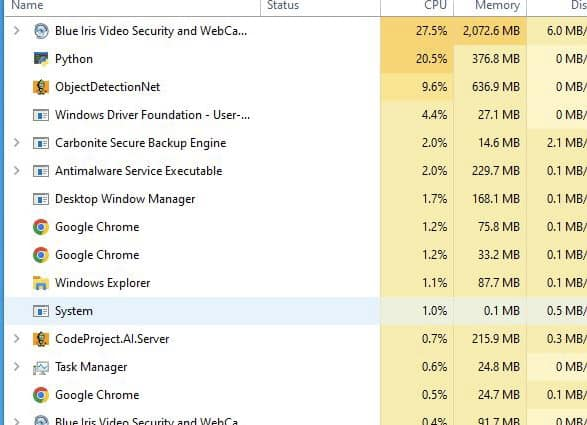

## Unable to load model at C:\Program Files\CodeProject\AI\modules\ObjectDetectionYolo\assets\yolov5m.pt

A user encountered the following error on their CodeProject.AI Server console.

```
1:08:29 PM: Object Detection (YOLO): Unable to load model at C:\Program Files\CodeProject\AI\modules\ObjectDetectionYolo\assets\yolov5m.pt (CUDA error: no kernel image is available for execution on the device
1:08:29 PM: Object Detection (YOLO): Unable to create YOLO detector for model yolov5m
```


In this case the user was using an NVIDIA GeForce GTX 660, with driver version 30.0.14.73481. This card has compute capability 3.0 which, at the time of the message's posting was below what CodeProject.AI Server supported. However, this user was also trying to use YOLO detection, which only works for custom models. The fix for this is to go to the CodeProject.AI Server dashboard, stop **Object Detection (YOLO)** by clicking the three dots next to it on the dashboard, selecting **Stop**, then going to **Object Detection (.NET)**, clicking on the the three dots and choosing **Start**.

## CodeProject.AI Server log shows requests every minute or less when there is no motion detection

In this instance a user was seeing requests in the CodeProject.AI Server log every minute or less when there was no motion detection.


Within Blue Iris there is an option within the **AI** tab in the camera settings panel called "**Detect/Ignore static objects**" where Blue Iris checks for static objects. If this box is checked, there will be a steady stream of requests in the CodeProject.AI Server log, because Blue Iris is constantly checking for static objects. Unchecking the "**Detect/Ignore static objects**" box and hitting **OK** resolves the issue.

## Browser cannot open port 321678

In this issue on the CodeProject.AI Server forum, a user could not access _http://localhost:32168_ and was unable to launch CodeProject.AI Server in their browser.


To resolve this issue, a user recommended using netstat to see if that port was listening. The user was using Windows. To do this, hit the **Win + R** keys on the keyboard to open the **Run** window, then type `cmd` to open the CMD prompt. From there, type `netstat -ano -p tcp`. This opens a list of all ports and indicates which ports are listening.


For this user, port 32168 did not show up on the list at all. The fix was to go to Windows services and start or restart CodeProject.AI Server. To do this, hit the **Win + R** keys on the keyboard to open the Run window, then type `services.msc`. This opens Windows services. Scroll down to CodeProject.AI Server and hit the "**Start Service**" button. CodeProject.AI Server then launches successfully.

## CodeProject.AI Server and Python using a lot of system resources



This issue comes fom the [Blue Iris User Group on Facebook](https://www.facebook.com/groups/blueirisuser2usersupport/posts/1151138335609417/) (note: it is a private group). This user reported that their CPU system resources were hitting 20%.


They provided an image of their CodeProject.AI Server dashboard and they were running both **Object Detection (.NET)** and **Object Detection (YOLO)**. These two modules were not meant to be used in unison. The solution is simply to turn **Object Detection (YOLO)** off. Go to the CodeProject.AI Server dashboard, click the three dots next to it on the dashboard, and select **Stop**.

## Confirmed but nothing detected


This issue comes from the [Blue Iris forums](https://blueirissoftware.com/forum/viewtopic.php?f=4&t=3752). In this instance Blue Iris detects motion but does not recognize anything. Blue Iris logs it as "Confirmed", but according to CodeProject.AI Server, nothing is found. The user wants to know why CodeProject.AI Server does not cancel this if nothing is found.


The solution comes from the [ipcamtalk forums](https://ipcamtalk.com/threads/5-5-8-june-13-2022-code-project%E2%80%99s-senseai.63895/page-49#post-707146). In the global **AI** tab on the camera settings, there is a field "**To cancel**." Using "Nothing found:0" in the "**To cancel**" box eliminates (green) "Nothing found" from the Confirmed alerts list. It forces the AI to search through all the images in an alert to select the best one.

## CodeProject.AI Server in Docker Container Doesn't Respond to Requests

In this setup, a user has CodeProject.AI running in a Docker container. CodeProject.AI loads, the web interface can be accessed, it can ping the Blue Iris server, but CodeProject.AI in both the Explorer and Blue Iris, just time out for detection requests and generate no logs.

Here's a few items to try:

Are there any firewall rules stopping POST requests to the CodeProject.AI server? You can obviously make GET calls in order to view the UI, and get updates.

*   If you see a decent set of logs then it means the backend modules can contact the front end server
*   If you can see any logs then it means the machine you're running the Explorer on can access the CodeProject.AI machine
*   Move the log detail slider all the way to the right to show Trace. If you see any "request from queue processing" type messages then it means requests are getting to the modules.
*   If you're seeing timeouts then either the modules are having issues returning values, or the modules are simply timing out does the dashboard show a object detection module running (green band)?
*   If you're at this point, maybe try stopping one object detection module and switching to another (eg try the .NET instead of the Python or vice versa)

## How Do I Resolve Error 500

With CodeProject.AI Server 2.1.6, a number of Blue Iris users report getting Error 500 in their Blue Iris logs.

Short version: try the latest Blue Iris release, version 5.7.5.6\. Should resolve it.

Long version: The error 500 issue revolves around how Blue Iris processes Face Processing requests and responses. There's no "error," rather Blue Iris is passing images to face recognition when there's no detectable face, and CodeProject.AI returns success = false (and code = 500) as a result. The call was made, the image processed, but the recognition processing failed because there's no face to recognise.

Purely an issue around what constitutes success and failure.

## Running CodeProject.AI on a Different System from Blue Iris

Here is an example of how to get CodeProject.AI Server running on a different system than Blue Iris and accessing its GPU. In this example, CodeProject.AI is in a Docker container on a Linux system.

1. Install all the CodeProject.AI Server pre-requisites on the Linux system. 

2. Downloaded the Docker image 

3. Running that Docker image, run the CPAI dashboard and explorer (localhost:32168) and make sure all was OK and the GPU is being used. 

4. Reboot the Blue Iris system. On the AI tab point to the IP/port address on the Linux system.

If the CodeProject.AI system is slower, start it first. Do not start from the Blue Iris.

## Slower detection times with Coral and Blue Iris

If you're experiencing slower than expected detection times and you have a decent system with a Coral USB to boot, you might be expecting to see sub-250 ms detections. If you're seeing higher detection times, there are a couple of settings in Blue Iris you can try.

In the main **AI** settings, in the **Default object detection** field, change the model size to **Small**. The reason for this, is that the Small is the fastest model.

The other thing to do, is within the camera settings, in the **Artificial Intelligence** tab, make sure **use main stream if available** is unchecked. Having it checked slows down detection speed and does not improve accuracy.