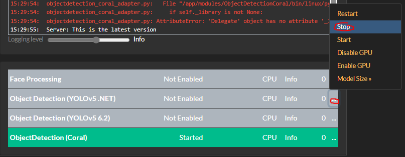
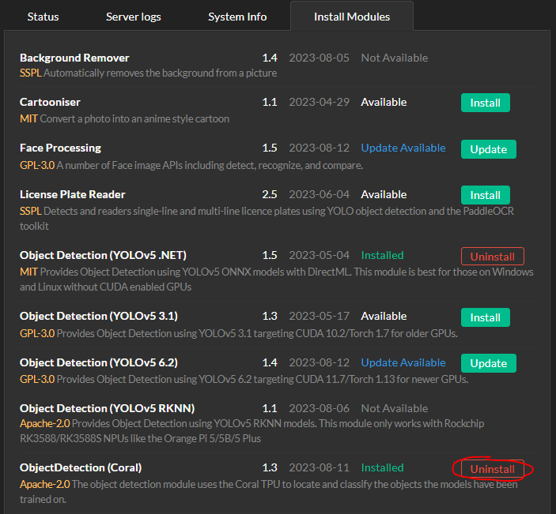
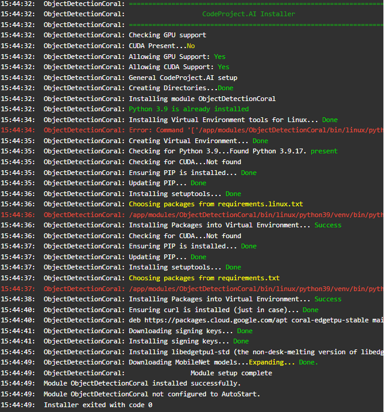
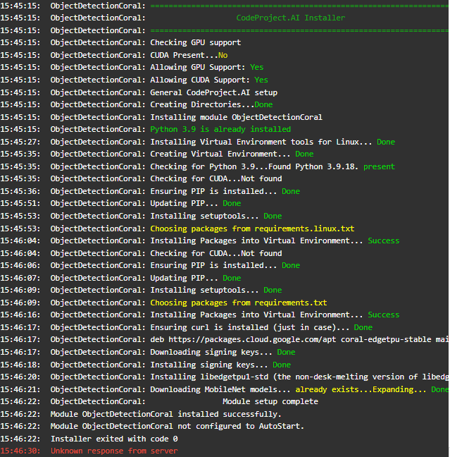

## The Coral USB dongle isn't working

If the Coral module installed OK but you're seeing errors (or no action) when you make calls to the module, try switching the USB port.

If you have the Coral plugged in via a dock or dongle, try and connect the Coral directly to your computer, or at the very least ensure the dock or dongle passed through enough power to the dongle.

If you are running on a Pi, ensure the Pi's power supply is sufficient to power the Pi and the Coral.

## How do you run Google Coral at max performance, and force the install of libedgetpu1-max?

If you're running CodeProject.AI Server in Docker or natively in Ubuntu and want to force the installation of libedgetpu1-max, first stop the Coral module from CodeProject.AI Server.

If in docker, open a Docker terminal and launch bash:

```  title='bash'
docker exec codeprojectai /bin/bash
```

Then for Docker or native Ubuntu, run:

```  title='bash'
sudo apt-get remove libedgetpu1-std
DEBIAN_FRONTEND=dialog sudo apt-get install libedgetpu1-max
```

Finally, start the Coral module from the CodeProject.AI Server web interface.

## Coral and Blue Iris - Slow detection times

If you're using Blue Iris and a Coral USB, you may see detection times increasing past 1000 ms. You may also experience an error: "The interpreter is in use. Please try again later"

In order to avoid this, in the Blue Iris main AI settings, change the model size to **Small**.

Additionally, ensure you aren't sending too many images to CodeProject.AI Server. You can adjust the amount of images you're sending to CodeProject.AI Server in the **Trigger** tab for your camera, under **Artificial Intelligence**. In the field **+ real-time images** make sure this number isn't too big. Somewhere around 10 should be a good value here, but you can adjust to taste.

## Using Coral M.2 Accelerator with Frigate

If you have a Coral M.2 Accelerator that you're sharing between CodeProject.AI Server and Frigate, it may interfere with detections. 

If this is the case, try shutting Frigate down and seeing if detections in CodeProject.AI Server resume.

## Problems getting CodeProject.AI Server to identify Coral M.2 Accelerator with Unraid

Some users have reported difficulty or errors like:

```
docker: Error response from daemon: could not select device driver "" with capabilities: [[gpu]].
```

when trying to get the CodeProject.AI Server Coral module working with their M.2. In these cases, stopping all Object Detection modules, uninstalling the Coral module, then re-installing it helps. 

A user made a helpful guide for this, that includes images and instructions on how to do a Docker install of CodeProject.AI Server on Unraid. The following is a re-working of that original article, with permission [unRAID-CoralTPU-Guide w/ CodeProject.AI](https://github.com/HarleyL7/unRAID-CoralTPU-Guide).

### Hardware Installation

*   USB Accelerator - [https://coral.ai/products/accelerator/](https://coral.ai/products/accelerator/)
*   M.2 Accelerator B+M key - [https://coral.ai/products/m2-accelerator-bm/](https://coral.ai/products/m2-accelerator-bm/)
*   M.2 Accelerator with Dual Edge TPU - [https://coral.ai/products/m2-accelerator-dual-edgetpu/](https://coral.ai/products/m2-accelerator-dual-edgetpu/)

If using the M.2 Accelerator with Dual Edge TPU you might have to use adapters to make it work with your system. These are located here:

*   [https://www.makerfabs.com/dual-edge-tpu-adapter.html](https://www.makerfabs.com/dual-edge-tpu-adapter.html)
*   [https://www.makerfabs.com/dual-edge-tpu-adapter-m2-2280-b-m-key.html](https://www.makerfabs.com/dual-edge-tpu-adapter-m2-2280-b-m-key.html)

Simply install the TPU in your system and boot up your Unraid server.

### Unraid Coral Drivers Installation

First you must make sure you have the community applications installed. This can be done by going here: [https://forums.unraid.net/topic/38582-plug-in-community-applications/](https://forums.unraid.net/topic/38582-plug-in-community-applications/)

Go to the **APPS** tab:


In the search bar type: coral accelerator module drivers


Once installed, go to **SETTINGS** > **CORAL DRIVER**. If Unraid can see your TPU then you will see something like this:


### CodeProject.AI Docker Install

Go back to the **APPS** tab in Unraid and search for codeproject.ai_server


Click on it and press install.

Next, pass through the Coral TPU by clicking **Add another Path, Port Variable, Label or Device**


Change Config Type to "Device"


In the **Value** field put:

*   USB - /dev/bus/usb
*   M.2 - /dev/apex\_0
*   Dual Edge TPU - /dev/apex\_0

Press **ADD** then press **APPLY**. It will pull the image and run the docker run command and you should have an output similiar to this:


### CodeProject.AI Coral Module Installation

Here, you want to stop all ObjectDetection modules, uninstall the Coral module, and re-install Coral module until it works, which you confirm by watching in the System Log tab. If there are any "pip" error messages then try and reinstall until sucessful. 

The PIP errors will look something like this:


Turn off all Object Detection Modules



Uninstall the Coral module



Go back to **Install Modules** and re-install the Coral module. Make sure to watch the server log to see if it worked without any PIP errors.

This is what a bad install looks like



And this is what a good install looks like



Once you acheive a good install, head back to the **Status** tab and enable ObjectDetection(Coral)

Now you should see this "Edge TPU detected" in the log and at the bottom "CPU" should have changed to "GPU(TPU)"

