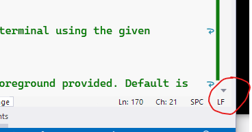

## 'command not found' during development setup on Linux/macOS

When running the setup script (or any script, for that matter) on Linux or macOS, you see an error of the form:

```
: No such file or directory 1: #1/bin/bash
: No such file or directory 10: ./utils.sh
setup.sh: line 11: $'\r': command not found
```

This indicates that the .sh script file has been saved with Windows-style CRLF line endings instead of Linux/Unix style LF line endings.

Open the script in Visual Studio or Visual Studio Code and at the bottom right of the editor window you will see a line ending hint



Click that and choose 'LF' to correct the line endings and re-run the script.

## Models not found

When building you see:

```
error MSB3030: Could not copy the file "<path>\\ObjectDetectionNet\\assets\\yolov5m.onnx"
  because it was not found.
```

Ensure you've run the development setup scripts before attempting to build


## Port already in use

If you see:
```text title=''
Unable to start Kestrel.
System.IO.IOException: Failed to bind to address http://127.0.0.1:5000: address 
   already in use.
```
Either you have CodeProject.AI already running, or another application is using 
port 5000.

Our first suggestion is to no longer use port 5000. It's a reserved port, though
not all operating systems are actively using it. We prefer port 32168 since it's
easy to remember and well out of harm's way of other used ports.

You can change the external port that CodeProject.AI uses by editing the 
<i>appsettings.json</i> file and changing the value of the <code>CPAI_PORT</code> 
variable. In the demo app there is a Port setting you will need to edit to match 
the new port.

Failing that, shut down any application using port 5000 (including any installed version of CodeProject.AI Server if you're trying to run in Development mode in Visual Studio)..


## Can't find custom models

When CodeProject.AI Server is installed it will comes with multiple object detection modules.
All generally work the same, with the differences being in the languages and platforms supported as well as the models that are used.

1. Ensure Object Object detection is enabled (it is by default)
2. Use the provided custom models, or 

    a) add your own models to the module's custom model folder  (eg `C:\Program Files\CodeProject\AI\modules\ObjectDetectionYolo\custom-models` for the Python YOLO detector, or `C:\Program Files\CodeProject\AI\modules\ObjectDetectionNet\custom-models` for the .NET Object detector, just to name two modules) 

    b) specify a directory that will contain the models (See the [Docker](../install/running_in_docker.md) guide)

To specify a different folder to use for custom models, you can

1. Set the `--Modules:ObjectDetectionYolo:EnvironmentVariables:CUSTOM_MODELS_DIR` parameter when launching, <b>or</b>
2. Set the `Modules:ObjectDetectionYolo:EnvironmentVariables:CUSTOM_MODELS_DIR` environment variable, <b>or</b>
3. Set the `CUSTOM_MODELS_DIR` value in the modulesettings.json file in the ObjectDetectionYolo folder, <b>or</b>
4. Set the global override (to be deprecated!) variable `MODELSTORE-DETECTION` to point to your custom object folder, <b>or</b>
5. (For Docker) Map the folder containing your custom models (eg. `C:\MyCustomModels`) to the Object 
   Detection's custom assets folder (`/app/modules/ObjectDetectionYolo/custom-models`). An
  example would be:

    ``` cmd
    docker run -p 32168:32168 --name CodeProject.AI-Server -d ^
      --mount type=bind,source=C:\ProgramData\CodeProject\AI\docker\data,target=/etc/codeproject/ai ^
      --mount type=bind,source=C:\MyCustomModels,target=/app/modules/ObjectDetectionYolo/custom-models,readonly 
        codeproject/ai-server
    ```

    This mounts the `C:\MyCustomModels` directory on my local system and maps it to the /app/modules/ObjectDetectionYolo/custom-models folder in the Docker container. Now, when CodeProject.AI Server is looking for the list of custom models, it will look in `C:\MyCustomModels` rather than `/app/modules/ObjectDetectionYolo/custom-models`

    See the [API Reference - CodeProject.AI Server](https://www.codeproject.com/AI/docs/api/api_reference.html#custom-object-detector)


## Server startup failed

```
System.ComponentModel.Win32Exception: The system cannot find the file specified.
   at System.Diagnostics.Process.StartWithCreateProcess(ProcessStartInfo startInfo)
```

Ensure you've run the development setup scripts before attempting to start the server.

## Background Remover doesn't run VS Debug GPU

Having a path to your development solution directory that is too long will prevent some modules from working due to the 256 char limit on file names in Windows. If you see something like the following error:

```
rembg_adapter.py:   File "C:\Users\matth\source\repos\codeproject\CodeProject.AI-Server-Private\src\modules\BackgroundRemover\bin\windows\python39\venv\lib\site-packages\numba\core\caching.py", line 662, in _save_overload
rembg_adapter.py: FileNotFoundError: [Errno 2] No such file or directory
```

Simply move the directory with the repo in it to a shorter directory, like _C:\Dev_, and run the Clean and Setup again. This is required as the Python virtual environment has a hard link to the old directory structure.