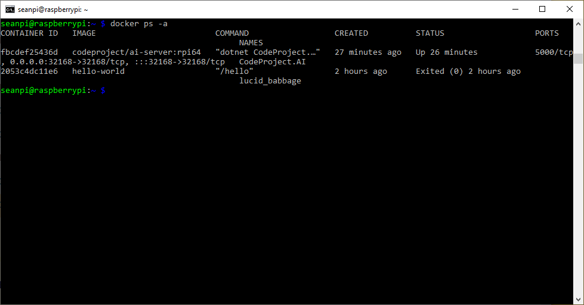
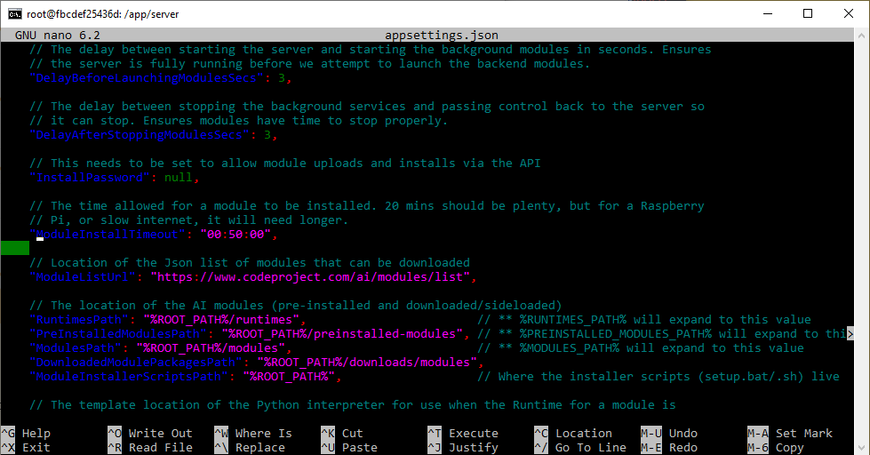
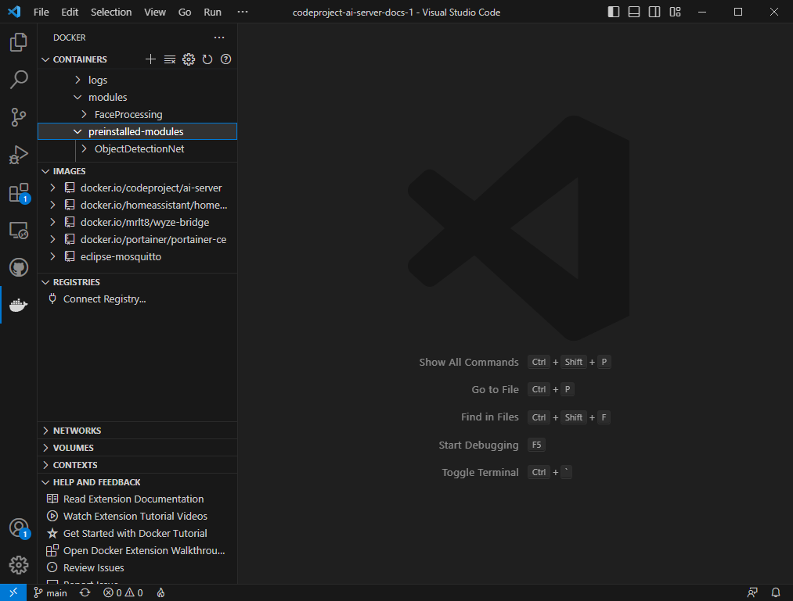

## Inference may randomly crash if running Docker in Windows under WSL2.

When Docker is installed on Windows it will, by default, use WSL2 if available. WSL2 will only use a max of 50% of available memory which isn't always enough. To solve this you can create a *.wslconfig* file to change this:

``` shell title='.wslconfig'
# Place this file into /users/<username> 

# Settings apply across all Linux distros running on WSL 2
[wsl2]

# Limits VM memory to use no more than 12 GB, this can be set as whole numbers 
# using GB or MB. The default is 50% of available RAM and 8GB isn't (currently) 
# enough for CodeProject AI Server GPU
memory=12GB 

# Sets amount of swap storage space to 8GB, default is 25% of available RAM
swap=8GB
```

## TF-Lite install hangs on Docker

If you're running Docker on a Linux system, and if you see the following error:

```text
objectdetection_tflite_adapter.py: ModuleNotFoundError: No module named 'cv2'
Module ObjectDetectionTFLite has shutdown
```

This is a timeout. As of CodeProject.AI Server 2.1.9, we've added the ability to adjust the `ModuleInstallTimeout` value in _appsettings.json_. In order to edit _appsettings.json_ you need to update the file from the command line.

``` shell
docker ps -a
```

First, you need the Container ID for your CodeProject.AI Server Docker container. From the command line, type, `docker ps -a`.



The Container ID is under the CONTAINER ID column. For me this is `fbcdef25436d`. Now that we have the Container ID, we need to access the container from the command line. To do this we input `docker exec -u 0 -it containerID bash`.

Next we need to install a text editor to edit the _appsettings.json_ file. Before we do that, we have to type `apt-get update` to make sure we have the most recent packages. I'm installing nano, but you could install vim if you want, To install nano, type `apt-get install nano`.

Once nano finishes installing, you can use it to edit the _appsettings.json_ file. Type `nano appsettings.json`. It's hard to see where `ModuleInstallTimeout` is, so hit Ctrl and "W" to search the files, and type "where-is-moduleinstalltimeout".



Once `ModuleInstallTimeout` is located, you can edit the length of time. The default is 20 minutes, which should be plenty, but if it's timing out due to internet issues, or just being slower on a Raspberry Pi, you might want to double it. Once you've edited the number, hit Ctrl + X, and then "Y" to indicate you would like to Save the modified buffer, then hit Enter.

You'll have to restart the Pi (if you're using a Pi) or restart your container for the change to take effect.


## Error response from daemon: invalid mode: /etc/codeproject/ai.

If you're in Windows, ensure you're running Docker from Windows Powershell or terminal, and not from a WSL terminal.

## Modules fail to run when installed in Docker with mappings

When installing CodeProject.AI Server in a Docker container and mapping your modules to a specific folder, you may get an error like:

``` text
ModuleNotFoundError: No module named 'aiohttp'
```

This is a timeout. As of CodeProject.AI Server 2.1.9, we've added the ability to adjust the `ModuleInstallTimeout` value in _appsettings.json_. In order to edit _appsettings.json_, go to Visual Studio Code. In the Extensions tab, search for "Docker" and install the Docker extension to Visual Studio Code if you haven't alraedy.

Then, from the Docker icon on the left-hand side of Visual Studio Code, look under Containers -> app -> server, then find _appsettings.json_. Select the file, then click the Open icon. Then navigate to `ModuleInstallTimeout`.

```json
    // The time allowed for a module to be installed. 20 mins should be plenty, but for a Raspberry
    // Pi, or slow internet, it will need longer.
    "ModuleInstallTimeout": "00:20:00",
```

The default is 20 minutes, which should be plenty, but if it's timing out due to internet issues, you might want to double it. Once you've edited the number, hit Ctrl + S to Save.

## You have an NVidia card but GPU/CUDA utilization isn't being reported in the CodeProject.AI Server dashboard when running under Docker

Please ensure you start the Docker image with the `--gpus all` parameter:

``` text
docker run -d -p 32168:32168 --gpus all codeproject/ai-server:cuda11_7
```

## Docker with volumes: Re-installing a pre-installed module and starting a new container result in module in both module dirs

If you create a Docker container with a volume mapped to the _/app/moduels_ directory  the changes to this directory are persisted in the volume across container restarts and updates. So, when you uninstall a pre-installed module, it is removed from the pre_installed directory. Re-Installing it adds it to the modules directory.

For example, if you use Docker Compose with the following _docker-compose.yml_

``` yaml
version: '3'
services:
  CodeProjectAI:
    image: codeproject/ai-server
    container_name: "CodeProjectAI"
    ports:
      - "32168:32168"
    environment:
      - TZ=America/Toronto
    volumes:
      - cpaidata:/etc/codeproject/ai
      - cpaimodules:/app/modules
    restart: unless-stopped

volumes:
  cpaidata:
  cpaimodules:
```


Then un-install one of the pre-installed modules, like Face Processing, or Object Detection (YOLOv5.6.2), then re-install it, then delete that container and restart it from the same image, or upgrade CodeProject.AI Server the pre-installed module will move to the modules directory.

Ultimately, while messy, this is not a problem if the newly installed module is compatible with the docker container's service.