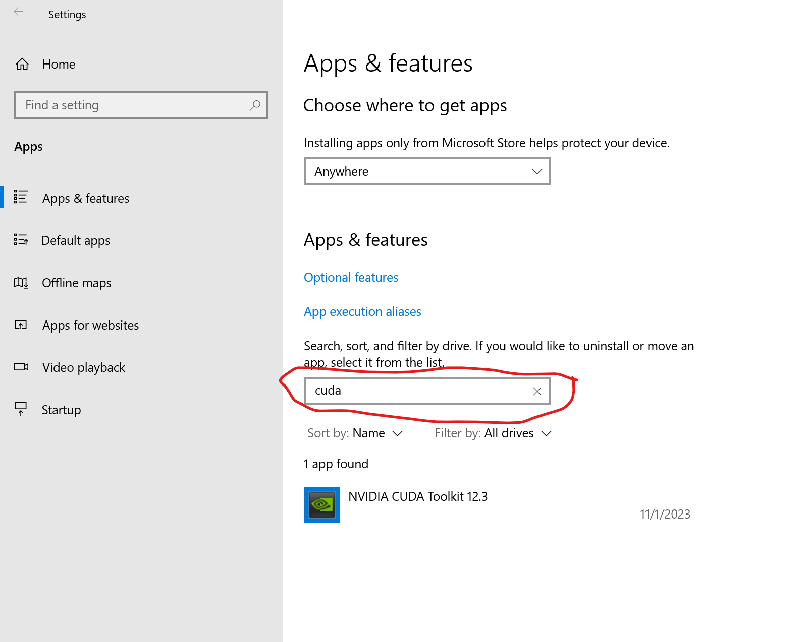

## GPU is not being used

Please ensure you have the NVIDIA CUDA drivers installed:

1.  Install the [CUDA 11.7 Drivers](https://www.nvidia.com/Download/index.aspx)
2.  Install the [CUDA Toolkit 11.7](https://developer.nvidia.com/cuda-downloads).
3.  Download and run our [cuDNN install script](https://www.codeproject.com/KB/Articles/5322557/install_CUDnn.zip).

## Inference randomly fails

Loading AI models can use a lot of memory, so if you have a modest amount of RAM on your GPU, or on your system as a whole, you have a few options

1.  Disable the modules you don't need. The dashboard (http://localhost:32168) allows you to disable modules individually
2.  If you are using a GPU, disable GPU for those modules that don't necessarily need the power of the GPU.
3.  If you are using a module that offers smaller models (eg Object Detector (YOLO)) then try selecting a smaller model size via the dashboard

Some modules, especially Face comparison, may fail if there is not enough memory. We're working on meaking the system leaner and meaner.

## You have an NVIDIA card but GPU/CUDA utilization isn't being reported in the CodeProject.AI Server dashboard when running under Docker

Please ensure you start the Docker image with the `--gpus all` parameter:

```  title='Terminal'
docker run -d -p 32168:32168 --gpus all codeproject/ai-server:cuda11_7
```

## How to downgrade CUDA to 11.8

If you're on Windows and having issues with your GPU not starting, but your GPU supports CUDA and you have CUDA installed, make sure you are running the correct CUDA version. 

Open the command prompt and type

```  title='Terminal'
run nvcc --version
```

On Windows, we recommend running CUDA 11.8. If you are not running CUDA 11.8, un-install your version of CUDA then download and install CUDA 11.8: [https://developer.download.nvidia.com/compute/cuda/11.8.0/local_installers/cuda_11.8.0_522.06_windows.exe](https://developer.download.nvidia.com/compute/cuda/11.8.0/local_installers/cuda_11.8.0_522.06_windows.exe)

## CUDA not available

If have an NVIDIA card and you're looking in the CodeProject.AI Server logs and see:

```  
CUDA Present...False
```

You can check to see what version of CUDA you're running by opening a terminal and running:

```  title='Terminal'
nvidia-smi
```

then:

```  title='Terminal'
run nvcc --version
```

If you see `nvcc --version` is unknown, you may not have CUDA installed. You can confirm this by going Windows **Settings**, then **Apps & features** and searching for "CUDA" and see what comes up. If CUDA is installed, you will see the following:

