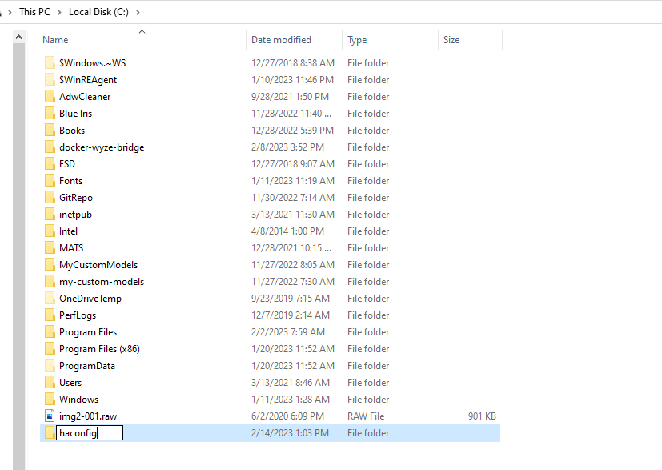
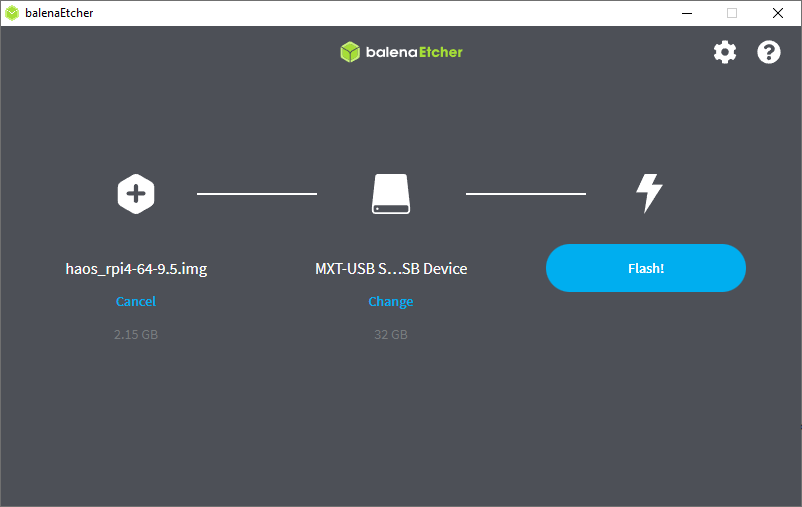
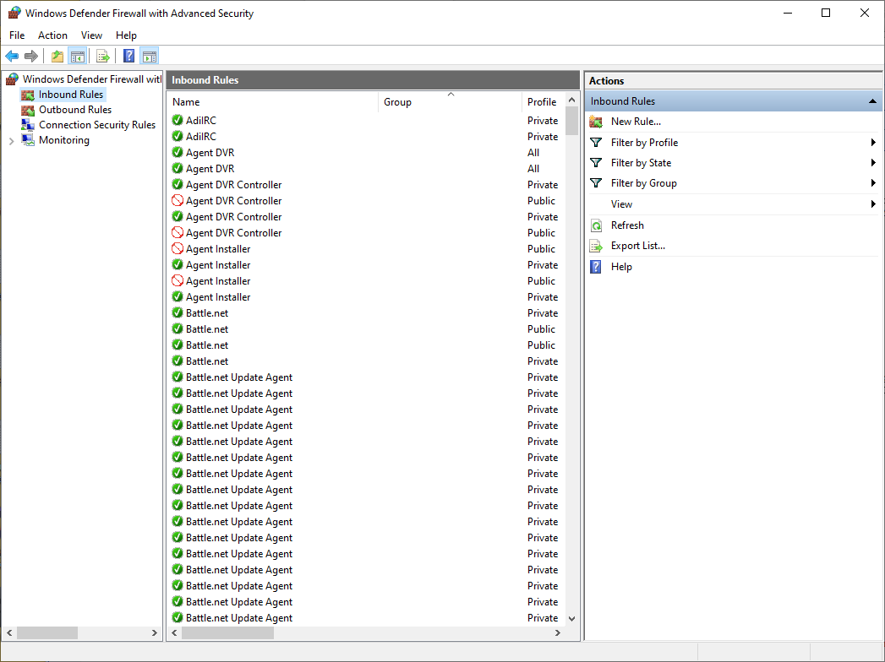
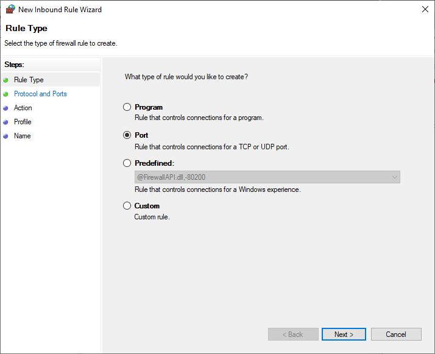
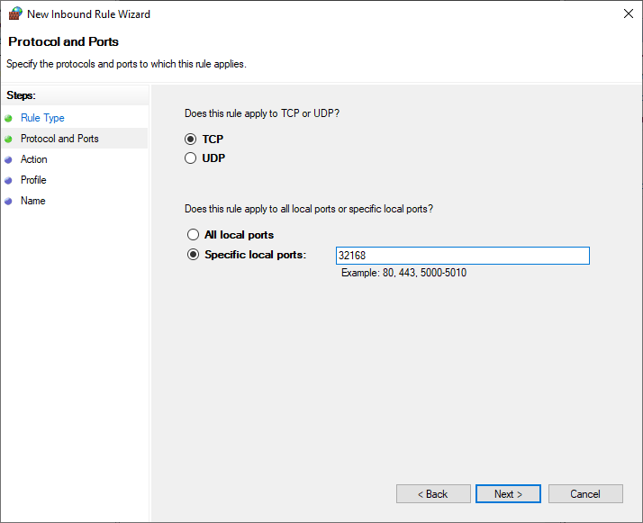
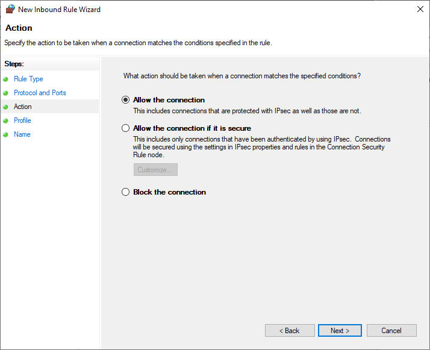
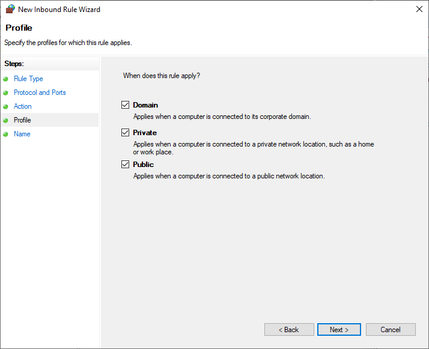
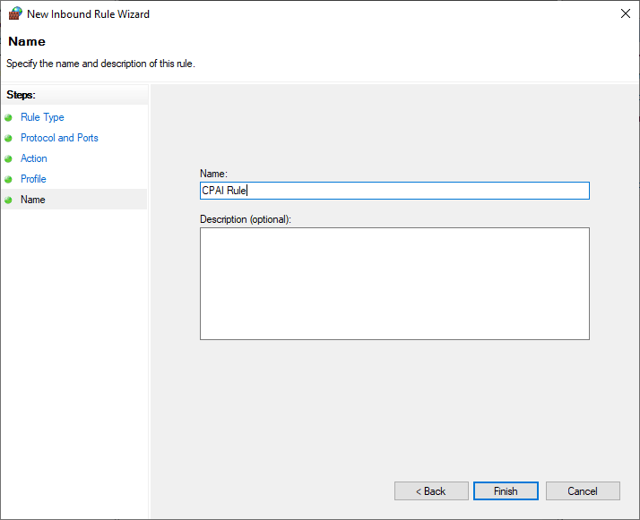

## Where is my Home Assistant Container config folder?

If you're setting up Home Assistant Container, the Docker command you need to run in order to establish a _config_ folder for Home Assistant is specific, in addition to being specific to your operating system. You need the _config_ folder in order to be able to edit the Home Assistant _configuration.yaml_ file, which is required for setting up a lot of integrations in Home Assistant.

The first thing we need to do is create a configuration folder for Home Assistant.



The configuration folder will be on whatever drive you run the Docker pull on, which in my case, is the _C:\_ drive. So open Windows Explorer, go to the _C:\_ drive, right-click in the folder area, and go to **New -> Folder**. Input the folder name you want. This examples calls the folder  "haconfig".

Now go to the **Start** button for Windows and type "CMD" and open Command Prompt. Then type

```  title='Terminal'
docker run -d --name homeassistant --privileged --restart=unless-stopped -e TZ=America/Edmonton -v c:\haconfig:/config -p 8123:8123 homeassistant/home-assistant:latest
```

where `--name homeassistant` is the name of your container, `TZ=America/Edmonton` is the time zone for Home Assistant (just enter your own time zone here), and `-v c:\haconfig:/config` is the path of the config folder (if you created a folder in _C:\Users\Joseph\haconfig_ this would be `-v C:\Users\Joseph\haconfig:/config)`.

## balena Etcher Error - Attention Something Went Wrong

If you're using balena Etcher to set up Home Assistant OS, you might be trying to use **Flash from URL**. For most people, this should work. But some might get an error:

```
Attention. Something went wrong. if it is a compressed image, please check that the archive is no corrupted. Command failed: cmd /c "C:\Users\AppData\Local\Temp\etcher\balena-etcher-electron-78afb6aee66.cmd"
```

Try downloading the first image instead of pointing to the Git URL. 



Take the URL _https://github.com/home-assistant/operating-system/releases/download/10.0/haos_rpi4-64-10.0.img.xz_ and put it into a browser window. It automatically downloads. Go back to balena Etcher. Only this time, select **Flash from a file** instead of from a URL. Select the _haos_rpi4-64-10.0.img.xz_ that downloads automatically.

## socket.gaierror: [Errno -2] Name does not resolve

If you're setting up CodeProject.AI Server on a different machine than Home Assistant (for example, on Windows), when you call CodeProject.AI Server, it might not be able to be reached. Here is the error in the Home Assistant logs, _home-assistant.log_, which can be found from **File Editor** in the left navigation pane by clicking the **Browse Filesystem** button.

```
 File "/usr/local/lib/python3.10/site-packages/requests/adapters.py", line 565, in send
    raise ConnectionError(e, request=request)
requests.exceptions.ConnectionError: HTTPConnectionPool(host='http', port=80): Max retries exceeded with url: //10.0.0:32168/v1/vision/detection (Caused by NewConnectionError('<urllib3.connection.HTTPConnection object at 0x7f9fd21990>: Failed to establish a new connection: [Errno -2] Name does not resolve'))
```
Despite being on the same network, you need to open port 32168 so it can communicate with the Pi. Here's how to you do that on Windows 10.

From the Windows **Start** button, select **Settings**. Then select **Update and Security**. Then select **Windows Security** from the left navigation pane and click the **Open Windows Security** button. Then select **Firewall and nework protection** from the left navigation pane, then **Advanced Settings**. Click **Yes** to allow the app to make changes. Now click **Inbound Rules**.



From here, click **New Rule...**.



We want to create a rule for port 32168, so select **Port** then hit **Next**.



Make sure **TCP** is selected, then in **Specific local ports** type "32168" and hit **Next**.



The default selection is **Allow the connection** which is correct. Hit **Next**.



Check all these boxes and hit **Next**.



You can name the rule whatever you want. Probably best to name it something you'll recognize later. Hit **Finish**. Now CodeProject.AI Server can be called from Home Assistant OS on my Raspberry Pi 4.