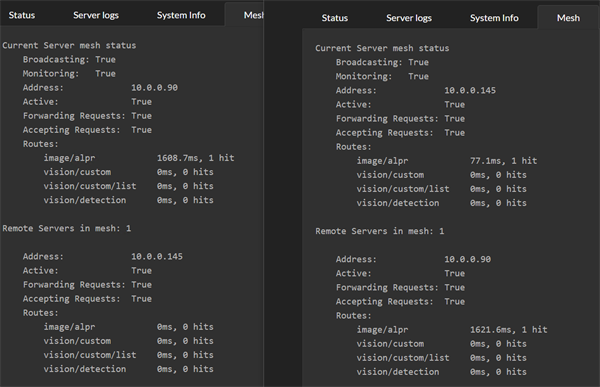
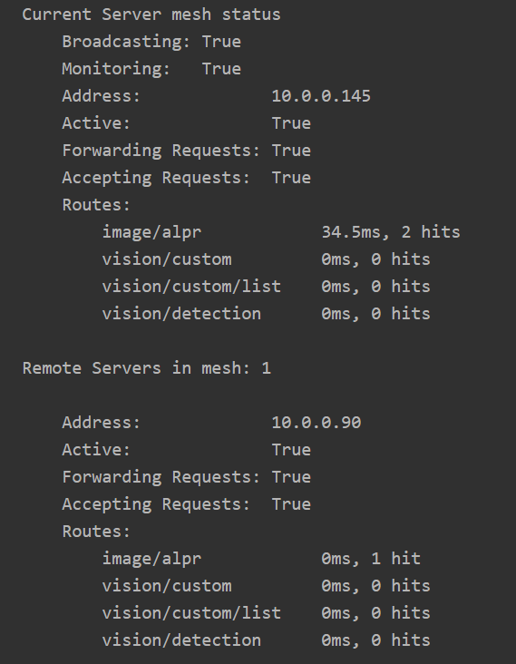
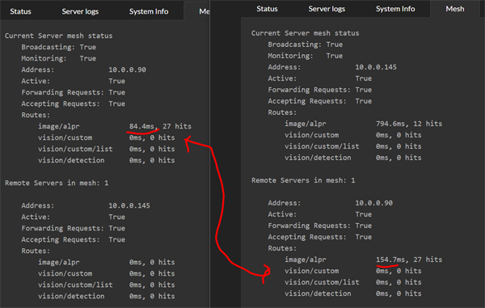
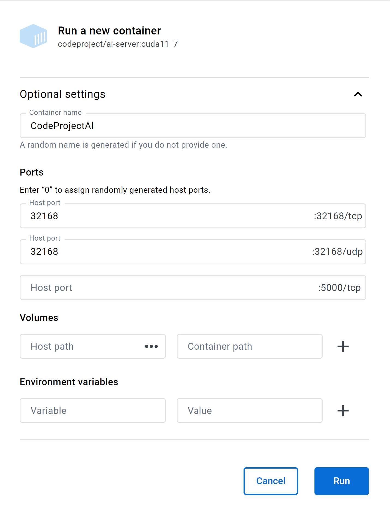

---
---
title: The CodeProject.AI Server Mesh
tags:
  - CodeProject.AI
  - Mesh
---

# The CodeProject.AI Server Mesh

One of the core issues we face when handling AI related tasks is computing power. Generally the bigger the better, but you can get away with a lower calibre machine if you aren't stressing it too much. But what happens when an unexpected load hits and your tiny machine starts to creak and groan? What you really want is a system to allow you to offload AI tasks to other servers if you have other servers sitting around with capacity to take on work.

This is where Mesh comes into play.



Here we see two machines, each with CodeProject.AI Server installed, each with the new Mesh functionality enabled.

Each server will handle its own requests, but is also aware of other servers in the mesh and will send requests to other servers if it thinks another server can do better. To determine whether another server can do better, each server will simply try out the other servers and see how they go. From then on the server receiving a request will either process the request itself, or pass it to another server if another server can do it faster.

In the above image, server .145 processed two ALPR requests. The first it handled itself with a 77ms response. The second request it passed to the remote .90 server, which recorded a response time of 1621ms. The remote server will not get any further requests while it's response time is that high.

After a (configurable) period of time, the recorded response time of remote servers will "decay". Older request timings are discarded and the "effective" response time heads back to 0



Notice on .90, the response time for ALPR is now at 0.

Now imagine it's Black Friday and the carpark security goes nuts at 6AM. The current server gets a deluge of requests and can't keep up. The effective response time of the current server increases 10X to be nearly 800ms, and so it starts offloading requests to the other server.

The other server has warmed up, and that 16 second inference is nowhere in sight. The remote server runs a decent GPU and its local response time, even under load, is around 80ms



What we now see in the Mesh summary tab for the current server is the remote server processing the majority of the AI operations with an effective response time of 154ms. On the remote server, we see that it reports an effective response of 84ms, but remember that the remote server's timing doesn't include the network roundtrip or work involved in repackaging the initial AI request.

Mesh processing is purely optional and the dashboard makes it trivial to turn it on and off. There is zero configuration needed. All servers self-discover the mesh, register and unregister themselves from the mesh, and load balancing is built in. 

## Setup

There is no setup. It just works.

## OK, what about Settings.

The mesh settings are in the `appsettings.json` file in the server's root folder
under the `MeshOptions` branch. The most basic is whether or not mesh is enabled,
and this setting is exposed in the **Mesh** tab on the dashboard.

### EnableBroadcasting and MonitorNetwork

Other settings include `EnableBroadcasting` which sets whether or not the local
server will broadcast its availability to the local network, and `MonitorNetwork`
which sets whether the server will spend CPU cycles watching for other servers.
Mesh functionality does not rely on monitoring or broadcasting, so these flags
allow a server to see what's happening on the network without broadcasting 
potentially sensitive information.

### AcceptForwardedRequests and AllowRequestForwarding

These two settings determine whether or not a server will accept requests from
another server in the mesh, and whether it will send requests to other servers
in the mesh. These settings allow a server to provide support for other servers
without burdening other servers, or conversely, to use the mesh for support 
without allowing other servers to add load to itself.

An example would be a Raspberry Pi and a Macbook Pro. The Pi might have 
`AcceptForwardedRequests` false and `AllowRequestForwarding` true, and the mac
could have `AcceptForwardedRequests` true and `AllowRequestForwarding` as false.
This provides the Pi with help if needed, without worrying about the mac sending 
unwanted load.

## Routes and Modules

Each server in a mesh may have different modules installed, or indeed have different
models installed in a given module. Servers may also be running different hardware,
operating systems, or be attached to different peripherals such as external AI
accelerators such as the Coral.

Some modules also persist data locally as part of their process, and so calls to
different servers may result in different responses. Face recognition, for
instance, stores registered faces in a local database, and so a call to one
server to register a face, followed by a call to a different server to recognise
a face may fail if the other server does not also have that face registered.

With this is mind every route in every module can be marked as `MeshEnabled`. If
true, the server will expose this route (eg `/v1/vision/face/detect`) to the mesh.
If `MeshEnabled` is false (eg `/v1/vision/face/register`) then that route will 
not be available to other servers.

`MeshEnabled` is set in the `modulesettings.json` files for each module, under
the `Routes` branch in that file.

## Docker

### Known Servers: working around network issues

CodeProject.AI Server works within a Docker container, with the caveat that the broadcast that the server makes to announce its participation in a mesh may not make it through the network layers and subnet to other servers. This means that your Docker instance of CodeProject.AI server may be invisible to other servers looking for mesh participants.

To work around this, edit the appsettings.json file in the root directory of CodeProject.AI server for each server that wishes to use the Docker instance, and edit the `MeshOptions.KnownMeshHostnames` collection.

An example is we have a PC sitting in our dusty garage named PC-GARAGE. It's running CodeProject.AI Server in Docker. We have another server that would like to use PC-GARAGE, so on that server we edit the `appsettings.json` file to include this

``` json
  "MeshOptions": {
    "Enable": true,
    "KnownMeshHostnames": [ "PC-GARAGE" ]
  },
```
Our server will now regularly ping PC-GARAGE directly, instead of waiting for a UDP broadcast packet that will never arrive. Pinging PC-GARAGE will return the same information as PC-GARAGE is (fruitlessly) broadcasting and will enable our machine to start offloading requests to PC-GARAGE.

### Ensuring UDP traffic is enabled

To enable the broadcasting and the monitoring of the broadcasting, you will need to ensure UDP port 32168 is exposed by the Docker container.

If you are launching via command line then you will need to add `-p 32168:32168/udp`
to the command line to open map the UDP port that enables the servers to broadcast
their mesh status.

=== "Windows"

    ``` batch title='Command line'
    docker run --name CodeProject.AI -d -p 32168:32168 -p 32168:32168/udp codeproject/ai-server
    ```

=== "Linux"

    ``` batch  title='Terminal'
    docker run --name CodeProject.AI -d -p 32168:32168 -p 32168:32168/udp codeproject/ai-server
    ```

    If you are running Linux on Arm then use `codeproject/ai-server:arm64` instead
    of `codeproject/ai-server`

=== "Raspberry Pi (Arm64)"

    ``` batch  title='Terminal'
    docker run --name CodeProject.AI -d -p 32168:32168 -p 32168:32168/udp codeproject/ai-server:rpi64
    ```

=== "macOS (Intel)"

    ``` batch  title='Terminal'
    docker run --name CodeProject.AI -d -p 32168:32168 -p 32168:32168/udp codeproject/ai-server
    ```

=== "macOS (Apple Silicon)"

    ``` batch  title='Terminal'
    docker run --name CodeProject.AI -d -p 32168:32168 -p 32168:32168/udp codeproject/ai-server:arm64
    ```

If launching using Docker Desktop then the only extra thing needed for mesh support
is to fill in the 32168/udp port text box:




<!--
Currently a server running in a docker container can forward requests to servers
in the mesh, but servers outside the container are unable to see the server in
the Docker container. This means that you can run a server in a Docker container
and get mesh support for that server, but you cannot use a server in a Docker
container to provide mesh support for other servers.

-->