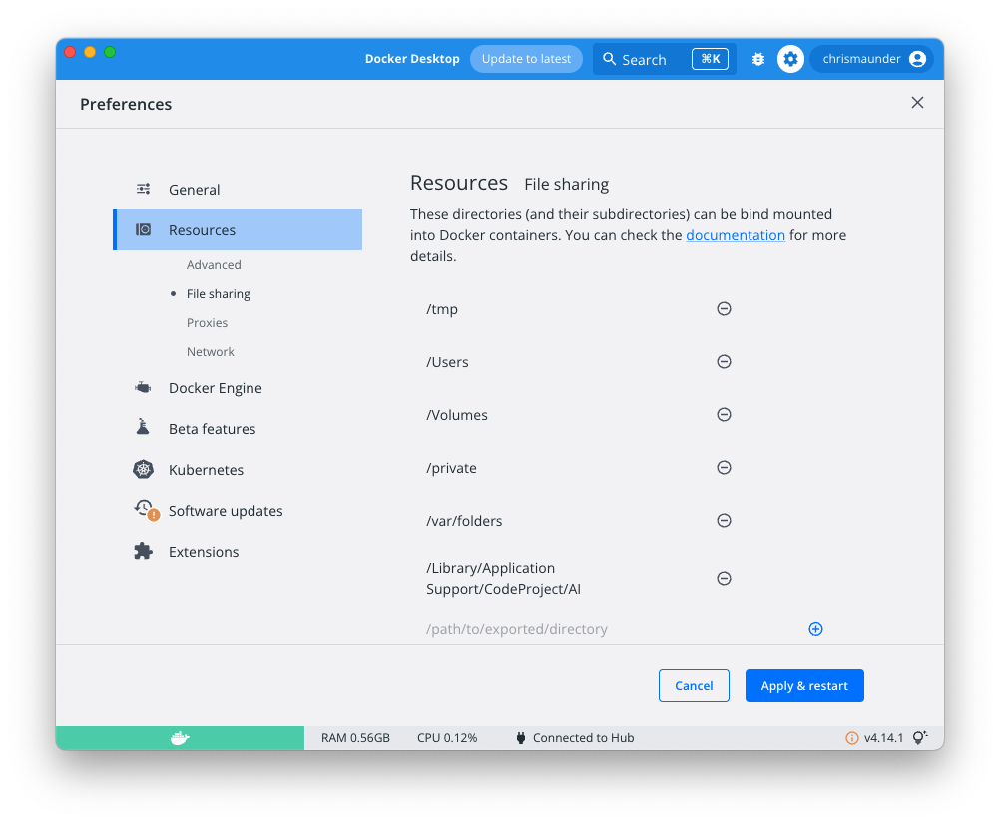
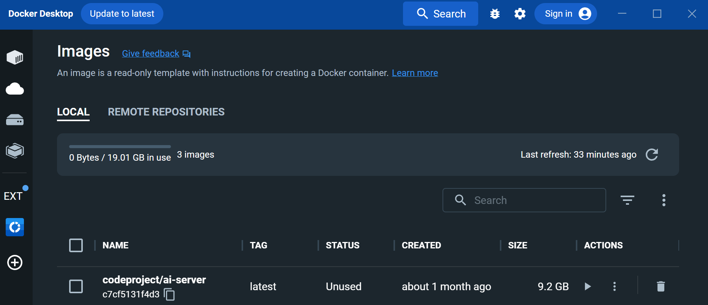
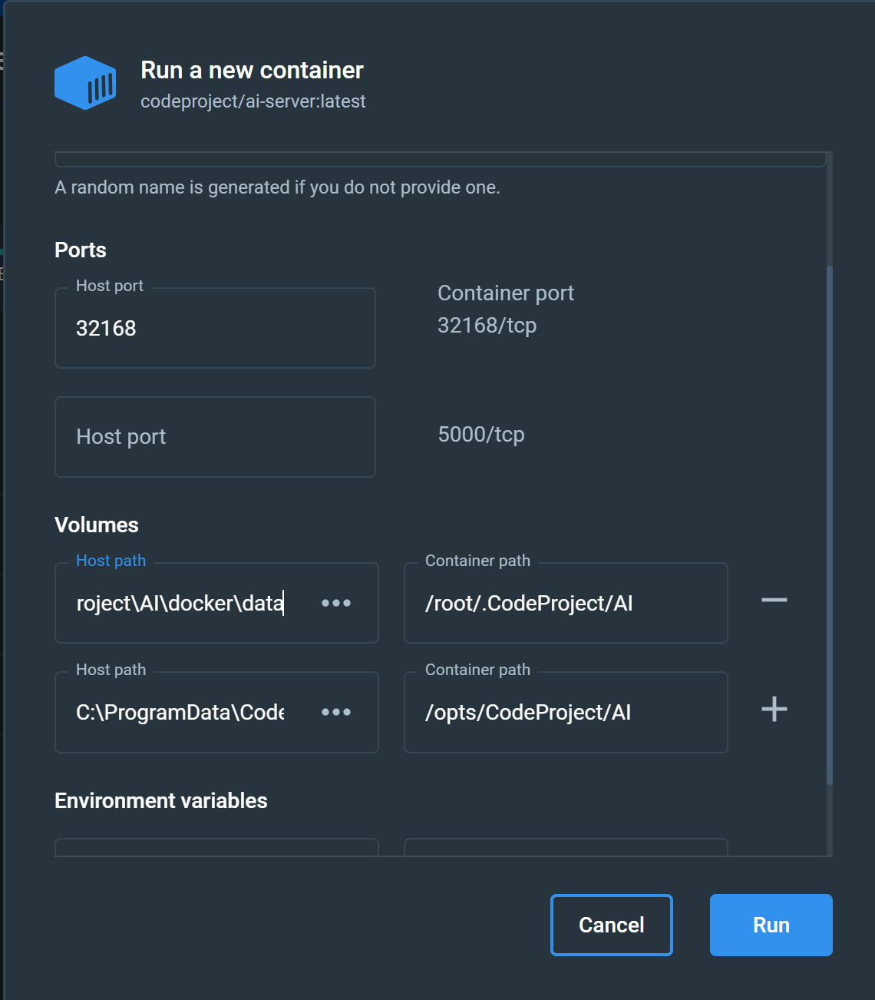
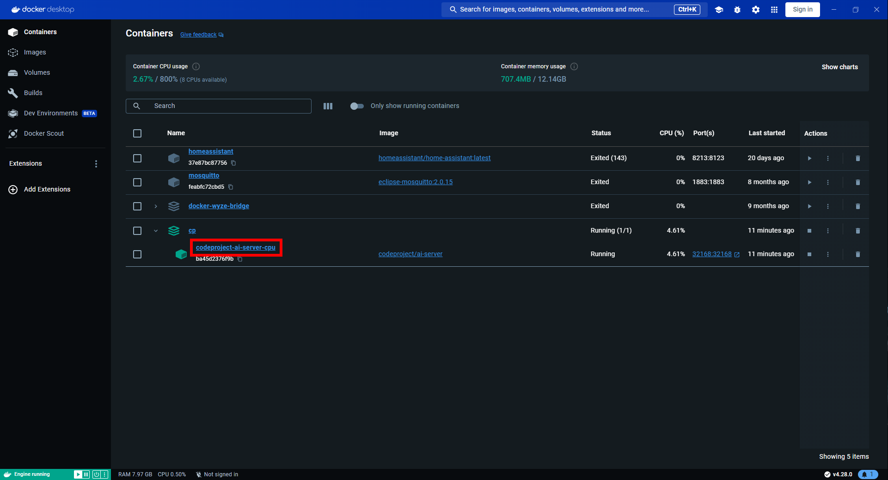
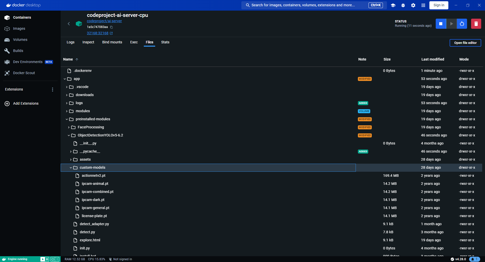

---
---
title: Running CodeProject.AI Server in Docker
tags:
  - CodeProject.AI
  - Docker
---

# Running CodeProject.AI Server in Docker

Docker is a technology that allows you to package up applications, libraries, 
drivers, runtimes, files, and anything else your application may need, all in a
single deployable image that can run wherever Docker can run. Which is
almost everywhere. The beauty is you don't have to worry about installing
drivers or packages or having version conflicts: everything you need to run is in
the container, ready to go.

To run CodeProject.AI Server in Docker you will need to [download and install](https://www.docker.com/)
Docker Desktop. This will install the runtime and desktop manager.

## CodeProject.AI Server images

 - **codeproject/ai-server** The basic CPU-only server for x64 systems
 - **codeproject/ai-server:cuda11_7** A GPU (NVIDIA CUDA 11.7) enabled version x64 systems.
  This image will also run on non-GPU systems.
 - **codeproject/ai-server:cuda12_2** A GPU (NVIDIA CUDA 12.2) enabled version x64 systems.
  This image will also run on non-GPU systems.
 - **codeproject/ai-server:arm64** An image built for Arm64 chipsets such as the
  Raspberry Pi or Apple Silicon devices.
 - **codeproject/ai-server:rpi64** A version specifically for Raspberry Pi Arm64
 devices. This contains an object detection module suited for low resource systems.

## Running a Docker container

There are two main ways to launch a Docker container: command line or using
Docker Desktop. 

When running a Docker image in a container you have two further choices

1. **Save settings and downloadable modules directly in the Docker container**. Each
   time you restart the container these settings will remain. If you update your
   Docker image and container you will lose your changes.
2. **Save settings and downloadable modules in a folder outside the Docker container**.
   This allows you to update your Docker image and container and keep all the modules and settings you've saved.

### Simple Docker launch (settings saved in the container)

For this case we simply need to map the ports used and choose the correct image.

=== "Windows"

    ``` batch title='Command line'
    docker run --name CodeProject.AI -d -p 32168:32168 codeproject/ai-server
    ```

    If you are running Windows on Arm then use `codeproject/ai-server:arm64` instead
    of `codeproject/ai-server`

=== "Linux"

    ``` batch  title='Terminal'
    docker run --name CodeProject.AI -d -p 32168:32168 codeproject/ai-server
    ```

    If you are running Linux on Arm then use `codeproject/ai-server:arm64` instead
    of `codeproject/ai-server`

=== "Raspberry Pi (Arm64)"

    ``` batch  title='Terminal'
    docker run --name CodeProject.AI -d -p 32168:32168 \
     --privileged -v /dev/bus/usb:/dev/bus/usb codeproject/ai-server:rpi64
    ```

    For those who have a USB device such as a Coral.AI Edge TPU, including the
    --privileged -v /dev/bus/usb:/dev/bus/usb flags will provide access to the
    Coral hardware.

=== "macOS (Intel)"

    ``` batch  title='Terminal'
    docker run --name CodeProject.AI -d -p 32168:32168 codeproject/ai-server
    ```

=== "macOS (Apple Silicon)"

    ``` batch  title='Terminal'
    docker run --name CodeProject.AI -d -p 32168:32168 codeproject/ai-server:arm64
    ```

### Advanced Docker launch (settings saved outside of the container)

We will need to map two folders from the Docker image to the host file system in
order to allow settings to be persisted outside the container, and to allow
modules to be downloaded and installed. This ensures that when you upgrade your
docker images, the settings and modules you've already downloaded remain.

The two folders are:

2. The settings folder (/etc/codeproject/ai in the Docker image)
3. The module downloads folder (/app/modules in the Docker image)

Note that we use different folders in each Operating System based on best practices.
`/etc` and `/opt` folders for Linux, `ProgramData` for Windows, and `Library\Application Support` for macOS.

=== "Windows"

    ``` batch title='Command line'
    docker run --name CodeProject.AI -d -p 32168:32168 ^
     --mount type=bind,source=C:\ProgramData\CodeProject\AI\docker\data,target=/etc/codeproject/ai ^
     --mount type=bind,source=C:\ProgramData\CodeProject\AI\docker\modules,target=/app/modules ^
       codeproject/ai-server
    ```

    If you are running Windows on Arm then use `codeproject/ai-server:arm64` instead
    of `codeproject/ai-server`

=== "Linux"

    ``` batch  title='Terminal'
    docker run --name CodeProject.AI -d -p 32168:32168 \
     --mount type=bind,source=/etc/codeproject/ai,target=/etc/codeproject/ai \
     --mount type=bind,source=/opt/codeproject/ai,target=/app/modules \
       codeproject/ai-server
    ```

    If you are running Linux on Arm then use `codeproject/ai-server:arm64` instead
    of `codeproject/ai-server`

=== "Raspberry Pi (Arm64)"

    ``` batch  title='Terminal'
    docker run --name CodeProject.AI -d -p 32168:32168 \
     --mount type=bind,source=/etc/codeproject/ai,target=/etc/codeproject/ai \
     --mount type=bind,source=/opt/codeproject/ai,target=/app/modules \
     --privileged -v /dev/bus/usb:/dev/bus/usb
       codeproject/ai-server:rpi64
    ```

    For those who have a USB device such as a Coral.AI Edge TPU, including the
    --privileged -v /dev/bus/usb:/dev/bus/usb flags will provide access to the
    Coral hardware.

=== "macOS (Intel)"

    ``` batch  title='Terminal'
    docker run --name CodeProject.AI -d -p 32168:32168 \
     --mount type=bind,source='/Library/Application Support/CodeProject/AI/docker/data',target=/etc/codeproject/ai \
     --mount type=bind,source='/Library/Application Support/CodeProject/AI/docker/modules',target=/app/modules \
       codeproject/ai-server
    ```

    !!! Info "File Sharing in macOS"

        By default, macOS only allows mounting to /tmp, /Users/Volumes/private and /var/folders.
        In order to bind mount to the /Library/Application Support folder you will need to
        go into Docker settings and add this folder

        

=== "macOS (Apple Silicon)"

    ``` batch  title='Terminal'
    docker run --name CodeProject.AI -d -p 32168:32168 \
     --mount type=bind,source='/Library/Application Support/CodeProject/AI/docker/data',target=/etc/codeproject/ai \
     --mount type=bind,source='/Library/Application Support/CodeProject/AI/docker/modules',target=/app/modules \
       codeproject/ai-server:arm64
    ```

    !!! Info "File Sharing in macOS"

        By default, macOS only allows mounting to /tmp, /Users/Volumes/private and /var/folders.
        In order to bind mount to the /Library/Application Support folder you will need to
        go into Docker settings and add this folder

        


## To use the GPU enabled images

The Docker GPU version is specific to NVidia's CUDA enabled cards with compute capability >= 6.0.
In order to ensure the Docker image has access to the GPU hardware, you need to use the 
`--gpus all` flag, and pull down the codeproject/ai-server:cuda11_7 image.

Note there is no Arm64 GPU-enabled build at this time.

=== "Windows"

    ``` batch title='Command line'
    docker run --name CodeProject.AI -d -p 32168:32168 --gpus all ^
     --mount type=bind,source=C:\ProgramData\CodeProject\AI\docker\data,target=/etc/codeproject/ai ^
     --mount type=bind,source=C:\ProgramData\CodeProject\AI\docker\modules,target=/app/modules ^
       codeproject/ai-server:cuda11_7
    ```

=== "Linux"

    ``` batch  title='Terminal'
    docker run --name CodeProject.AI -d -p 32168:32168 --gpus all \
     --mount type=bind,source=/etc/codeproject/ai,target=/etc/codeproject/ai \
     --mount type=bind,source=/opt/codeproject/ai,target=/app/modules \
       codeproject/ai-server:cuda11_7
    ```

The Docker GPU version will only run under Windows and Ubuntu. macOS no longer
supports NVidia hardware.


## Starting using Docker Desktop

To launch an image using Docker Desktop you will first need to pull an image from
Docker hub. In a command terminal run `docker pull codeproject/ai-server` to get 
the latest version of the CodeProject.AI Docker image, or use [one of the images](#codeprojectai-server-images) names listed above. You can launch a container 
using the image via Docker Desktop. 



In the Images tab, select the image you wish to run, click the 'Run' button, 
and then click Optional Settings



Set the following properties:

=== "Windows"

     - Ports: 32168 (or 5000 if you've been using legacy versions that expect port 5000)
     - Volumes (if you wish to persist settings outside the container):
        - Host Volume C:\ProgramData\CodeProject\AI\docker\data maps to Container path /etc/codeproject/ai
        - Host Volume C:\ProgramData\CodeProject\AI\docker\modules maps to Container path /app/modules

=== "Linux"

     - Ports: 32168 (or 5000 if you've been using legacy versions that expect port 5000)
     - Volumes (if you wish to persist settings outside the container):
        - Host Volume /etc/codeproject/ai maps to Container path /etc/codeproject/ai
        - Host Volume /opt/codeproject/ai maps to Container path /app/modules

=== "macOS"

     - Ports: 32168 (or 5500 if you've been using legacy versions that expect port 5500)
     - Volumes (if you wish to persist settings outside the container):
        - Host Volume /Library/Application Support/CodeProject/AI/docker/data maps to Container path /etc/codeproject/ai
        - Host Volume /Library/Application Support/CodeProject/AI/docker/modules maps to Container path /app/modules

 You can also provide an optional name. Just be sure not to include spaces.
 Docker Desktop is fussy.

 Click 'Run' and you're done.

## Docker Compose

 Here are some basic docker compose files to get you started. 

=== "CPU"

    ```yaml
    version: "3.9"

    services:
      CodeProjectAI:
        image: codeproject/ai-server
        container_name: codeproject-ai-server-cpu
        hostname: codeproject-ai-server
        restart: unless-stopped
        ports:
          - "32168:32168"
        environment:
          - TZ=America/Toronto 
    ```

=== "GPU Enabled"

    ```yaml
    version: "3.9"

    services:
      CodeProjectAI:
        image: codeproject/ai-server:cuda11_7
        container_name: codeproject-ai-server-cuda
        hostname: codeproject-ai-server
        restart: unless-stopped
        ports:
          - "32168:32168"
        environment:
          - TZ=America/Toronto
        deploy:
          resources:
            reservations:
              devices:
                - driver: nvidia
                  count: 1
                  capabilities: [gpu]
    ```

=== "CUDA 11.7"

    ```yaml
    version: '3.9'

    services:
      CodeProjectAI:
        image: codeproject/ai-server:cuda11_7
        container_name: "codeproject-ai-server-cuda"
        restart: unless-stopped
        ports:
          - "32168:32168"
        environment:
          - TZ=America/Toronto
        deploy:
          resources:
            reservations:
              devices:
                - driver: nvidia
                  count: 1
                  capabilities: [gpu]
    ```

=== "Raspberry Pi / Orange Pi"

    ```yaml
    version: "3.9"

    services:
      CodeProjectAI:
        image: codeproject/ai-server:rpi64
        container_name: codeproject-ai-server-rpi
        hostname: codeproject-ai-server
        restart: unless-stopped
        privileged: true
        ports:
          - "32168:32168"
        environment:
          - TZ=America/Toronto
        volumes:
          - '/dev/bus/usb:/dev/bus/usb'
    ```

=== "Apple Silicon"

    ```yaml
    version: "3.9"

    services:
      CodeProjectAI:
        image: codeproject/ai-server:arm64
        container_name: codeproject-ai-server-arm64
        hostname: codeproject-ai-server
        restart: unless-stopped
        ports:
          - "32168:32168"
        environment:
          - TZ=America/Toronto
    ```

Here's an example of how to use a docker compose file on Windows. Open up Notepad. Copy and paste the above command line into Notepad. Then save the file as a .yml, not .txt, and remember where you saved it.

Open a command line. Navigate to the folder where you saved the .yml file, then type :

    ``` batch title='Command line'
    docker compose docker-compose.yml up
    ```

where docker-compose.yml is the name of your .yml file.

If you want to use a docker compose file that will allow you to add custom models, make the following additions to your docker compose file:

    ```yaml
    version: "3.9"

    services:
      CodeProjectAI:
        image: codeproject/ai-server
        container_name: codeproject-ai-server-cpu
        hostname: codeproject-ai-server
        restart: unless-stopped
        ports:
          - "32168:32168"
        environment:
          - TZ=America/Toronto 
        volumes:
          - codeproject_ai_data:/etc/codeproject/ai
          - codeproject_ai_modules:/app/modules
    volumes:
      codeproject_ai_data:
      codeproject_ai_modules:
    ```

Then open a command line and type:

    ``` batch title='Command line'
    docker compose docker-compose.yml up
    ```

Open Docker Desktop and select the Containers tab and click on the container name



This will open up the container. There are a number of tabs that let you get information about the container. Click on the **Files** tab. This is where you would add/delete file from Volumes as they are mapped to directories in the container file system.



You can navigate to the custom-models directory, then drag and drop your custom model onto the folder name. 

## Changing Server settings

To change the settings of an instance of CodeProject.AI Server running in a Docker
container, you have two main options

1. Pass command line variables to the docker command. 
[Read more here](../api/module_settings.md#option-4-docker)

2. Use the CodeProject.AI Server settings API. You can [read more here](../api/module_settings.md#option-5-via-the-settings-api)

### Common example: specifying a folder for custom object detection files for the ObjectDetectionYolo module

The Object Detection (YOLO) module provides the ability to specify a folder that will
contain custom models. To access this functionality in Docker you simply map
the folder inside the docker instance to a folder on your host operating system.

This module comes **pre-installed** in most docker images (the exception being the Raspberry Pi
and Jetson docker images). Pre-installed modules live in /app/preinstalled-modules, rather than
/app/modules. This allows you to download, install and persist modules by mapping to the /modules
folder while still having pre-installed modules available.

Suppose we have our custom models in the `C:\my-custom-models` folder. To map this to the 
custom-models folder in the docker instance you would launch the image like:

``` batch  title='Terminal'
docker run --name CodeProject.AI -d -p 32168:32168 ^
 --mount type=bind,source=C:\ProgramData\CodeProject\AI\docker\data,target=/etc/codeproject/ai ^
 --mount type=bind,source=C:\ProgramData\CodeProject\AI\docker\modules,target=/app/modules ^
 --mount type=bind,source=C:\my-custom-models,target=/app/preinstalled-modules/ObjectDetectionYolo/custom-models,readonly ^
   codeproject/ai-server
```

## Accessing the CodeProject.AI Server Dashboard.
Open a browser and navigate to [http://localhost:32168](http://localhost:32168) to open the CodeProject.AI Dashboard.  This will provide you with details of the server operation.

## Explore the modules running in the server
We provide a sample application written in HTML and JavaScript that performs various AI operations.  Open [http://localhost:32168/explorer.html](http://localhost:32168/explorer.html) in a browser.  There is also a link to this at the top of the Dashboard.
<!--
### Get some test images
Load [http://localhost:32168/testdata.zip](http://localhost:32168/testdata.zip) (after launching CodeProject.AI server) to download some test images for use with the CodeProject.AI explorer
-->

## Adding new modules to a Docker container

As of version 1.6.8 there is now the ability to add modules to the host server and have them be run 
inside the Docker container. Version 2.0 of CodeProject.AI Server extends this too allow modules to
be downloaded and installed at runtime via the dashboard.

In our discussions on launching a Docker image above, we included a mapping of the 
/app/modules folder (in the Docker image) to a folder in the host file system 
(eg C:\ProgramData\CodeProject\AI\docker\modules). Doing this allows CodeProject.AI Server 
the chance to download, install and store modules that will persist over Docker container 
restarts.

It also provides the means for you to add a new module to an existing Docker container.

1. Launch your Docker container as per the instructions above. The downloaded modules
   in the Docker container are stored in /app/modules. In Windows you would have mapped
   this folder to C:\ProgramData\CodeProject\AI\docker\modules. in Linux you would have 
   mapped it to /opt/codeproject/ai, and in macOS it would be mapped to 
   /Library/Application Support/CodeProject/AI/docker/modules.

2. Copy your new module's folder into the mapped /app/modules folder on your host
   (eg. C:\ProgramData\CodeProject\AI\docker\modules in Windows).

3. Ensure the module's modulesettings.json settings file has `RuntimeLocation` set as "Local"".

    ```json
    "Modules": {
        "MyModuleId": {
          "Name": "My Module",
          "Version": "1.0",

          "LaunchSettings": {
              "FilePath": "my_module.py",
              "Runtime": "python38", 
              "RuntimeLocation": "Local", // Can be Local or Shared
    ```

4. Ensure you have a install.sh script for your module, in the module's folder.
   Any calls to 'setupPython' or 'installPythonPackages' should specify the install location as "Local".

5. Open a terminal to your Docker Container. Docker Desktop provides a neat GUI
   for doing this. Go to /app/modules/[your module folder] and execute 
   
    ``` bash
    bash ../../setup.sh
    ```

    This will run the setup script on your new module from within the Docker
    container, ensuring the module is setup correctly for the container's 
    operating system.

The next time you start the Docker container this module will be discovered and
started along with the other modules.